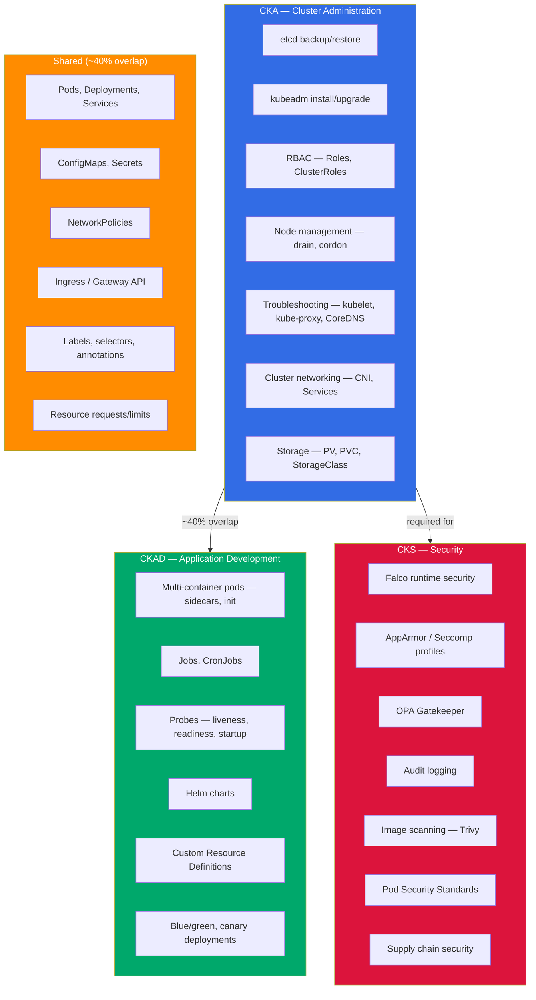
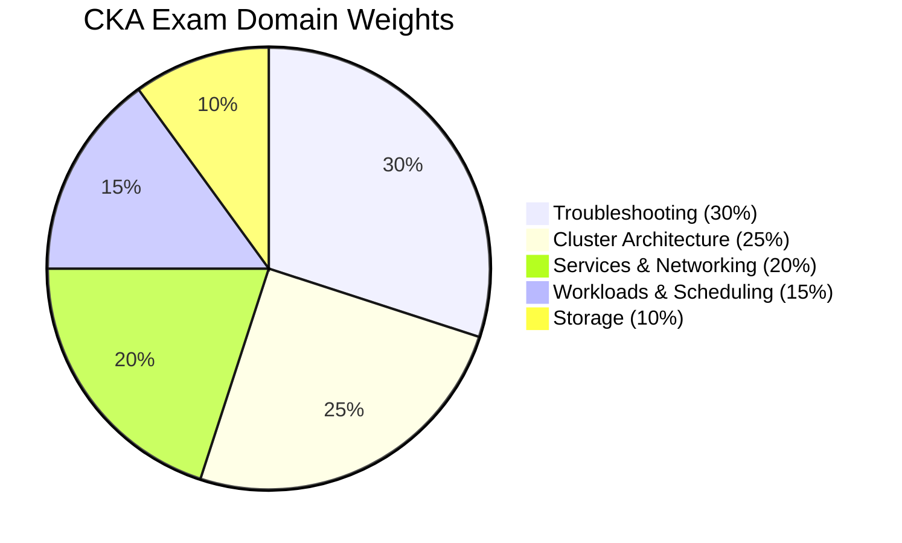
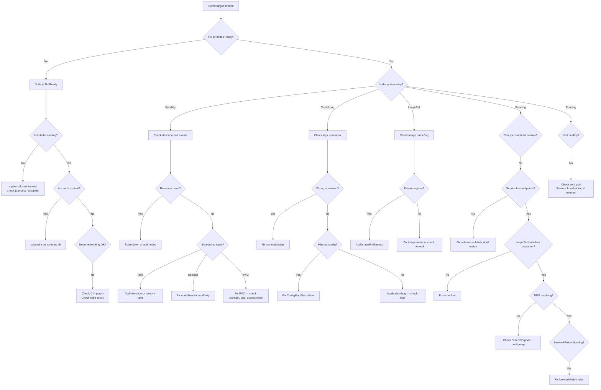

> **Note:** The content below is superseded by the interactive exam simulator.
> See [`cka-sim/`](./cka-sim/) for trap-aware drills, timed mocks, and automated grading.
> This content remains for reference but is no longer actively maintained.

[](https://opensource.org/licenses/MIT)
[](http://makeapullrequest.com)
[](https://github.com/theplatformlab/CKA-Certified-Kubernetes-Administrator/actions/workflows/validate.yml)
[]()
[](https://kubernetes.io/)
[](exercises/)
[](skeletons/)
[](mock-exams/)
[](https://github.com/theplatformlab/CKA-Certified-Kubernetes-Administrator)

**Disclaimer:** This is a study and practice resource. It contains practice exercises and training materials designed to help prepare for the CKA exam. It does not include, share, or reproduce actual CKA exam questions. All exercises are independently designed training scenarios. See [CONTRIBUTING.md](CONTRIBUTING.md) and [CODE_OF_CONDUCT.md](CODE_OF_CONDUCT.md) for policies.

> My CKA study notes, practice questions, and kubectl cheat sheet. Kubernetes v1.35. I scored 89% — this is everything I used to prepare.

# CKA Certification Guide 2026 — How I Passed with 89%

<p align="center">
  
</p>

I took the CKA in March 2026 and scored 89%. Writing this while it's fresh — partly because I was frustrated with how many outdated guides are still floating around (dockershim references in 2026, come on) and partly because organizing my notes helped me retain what I learned.

The [CKA](https://www.cncf.io/certification/cka/) is a hands-on, terminal-based exam. 2 hours, roughly 17-25 tasks, no multiple choice. I prepped for about 4 weeks. This repo has my notes, the commands I actually used, YAML I wrote from memory, and the mistakes I made along the way.

> Blog version of these notes: [Pass the CKA Certification Exam](https://techwithmohamed.com/blog/cka-exam-study-guide/)

If this was useful, a star helps others find it.

---

## Quick Start (< 4 Weeks to Exam)

If you're time-pressured, here's the fast track:

1. **Run the setup script** — get your aliases and vim config right from day one: [scripts/exam-setup.sh](scripts/exam-setup.sh)
2. **Do the exercises** — work through the [31 hands-on exercises](exercises/) in order. Each one targets a specific CKA domain.
3. **Use YAML templates** — reference [TEMPLATES.md](TEMPLATES.md) for all skeleton YAML. Copy, paste, modify.
4. **Do the mock exam** — practice under exam conditions with timed scenarios.
5. **Do killer.sh twice** — once 2 weeks out, once 3 days before. See [killer.sh vs the Real Exam](#killersh-vs-the-real-cka-exam).
6. **Read the exam day strategy** — the [two-pass approach](#exam-day-strategy--time-allocation) saved time on exam day.

---

## Repo Structure

```
CKA-Certified-Kubernetes-Administrator/
├── README.md                          # This guide (you're here)
├── exercises/                         # 31 hands-on labs
│   ├── 01-pod-basics/
│   ├── 02-multi-container-pod/
│   ├── 03-configmap-secret/
│   ├── 04-rbac/
│   ├── 05-networkpolicy/
│   ├── 06-deployment-rollout/
│   ├── 07-statefulset/
│   ├── 08-node-drain-cordon/
│   ├── 09-kubeadm-upgrade/
│   ├── 10-static-pod/
│   ├── 11-troubleshoot-cluster/
│   ├── 12-storage-pv-pvc/
│   ├── 13-helm-install-upgrade/
│   ├── 14-kustomize-overlays/
│   ├── 15-gateway-api/
│   ├── 16-hpa/
│   ├── 17-kubectl-debug/
│   ├── 18-cri-dockerd-setup/
│   ├── 19-ingress-classic/
│   ├── 20-pod-security-standards/
│   ├── 21-jobs-cronjobs/
│   ├── 22-priorityclass/
│   ├── 23-resource-requests-tuning/
│   ├── 24-priorityclass-patch/
│   ├── 25-storage-waitforfirstconsumer/
│   ├── 26-cri-dockerd-setup/
│   ├── 27-cni-tigera-install/
│   ├── 28-network-policy-complex/
│   ├── 29-troubleshoot-etcd-endpoint/
│   ├── 30-tls-configuration-update/
│   └── 31-argocd-gitops-setup/
├── TEMPLATES.md                       # All YAML templates in collapsible format
├── skeletons/                         # 23 YAML template files (see TEMPLATES.md)
├── mock-exams/                        # Full practice exams (15 questions, 2 hours each)
│   ├── MOCK-EXAM-01.md               # Practice questions
│   ├── MOCK-EXAM-01-SOLUTIONS.md    # Complete solutions and explanations
│   ├── MOCK-EXAM-02.md
│   └── MOCK-EXAM-02-SOLUTIONS.md
├── cheatsheet/
│   └── cka-cheatsheet.md              # One-page printable reference
├── troubleshooting/
│   └── README.md                      # Symptom-based lookup playbook
├── scripts/
│   ├── exam-setup.sh                 # Aliases, vim config, bash completion
│   └── validate-local.sh             # Local YAML validation (run before pushing)
├── .github/
│   ├── workflows/validate.yml         # CI — YAML lint on every push
│   ├── ISSUE_TEMPLATE/                # Bug, content request, exam feedback
│   │   └── config.yml                 # Discussions link for questions
│   └── PULL_REQUEST_TEMPLATE.md
├── CHANGELOG.md
├── CODE_OF_CONDUCT.md
├── CONTRIBUTING.md
├── SECURITY.md
└── LICENSE
```

---

## Table of Contents

### Start Here — Practice Your Skills
- [CKA Syllabus Breakdown (v1.35)](#cka-syllabus-breakdown-v135)
  - [Domain 1 — Storage (10%)](#domain-1--storage-10)
  - [Domain 2 — Troubleshooting (30%)](#domain-2--troubleshooting-30)
  - [Domain 3 — Workloads & Scheduling (15%)](#domain-3--workloads--scheduling-15)
  - [Domain 4 — Cluster Architecture, Installation & Configuration (25%)](#domain-4--cluster-architecture-installation--configuration-25)
  - [Domain 5 — Services & Networking (20%)](#domain-5--services--networking-20)
- [CKA Domain Weight Distribution](#cka-domain-weight-distribution)
- [Practice Scenarios with Full Solutions](#practice-scenarios-with-full-solutions)
- [Mock Exams — Final Preparation](#mock-exams--final-preparation)
- [Study Progress Tracker](#study-progress-tracker)

### Exam Preparation Strategy
- [The Exam Environment (PSI Remote Desktop)](#the-exam-environment-psi-remote-desktop)
- [First 60 Seconds — Aliases, vim, bash](#first-60-seconds--aliases-vim-bash)
- [Imperative Commands Quick Reference](#imperative-commands-quick-reference)
- [YAML Templates Quick Reference](#yaml-skeletons--write-these-from-memory)
- [Exam Day Strategy — Time Allocation](#exam-day-strategy--time-allocation)
- [Mistakes That Will Fail You on the CKA](#mistakes-that-will-fail-you-on-the-cka)
- [Vim Keys I Actually Used on Exam Day](#vim-keys-i-actually-used-on-exam-day)
- [Troubleshooting Decision Flowchart](#troubleshooting-decision-flowchart)
- [CKA Exam Day Checklist](#cka-exam-day-checklist)

### Study Resources & Planning
- [kubectl Cheat Sheet for CKA](#kubectl-cheat-sheet-for-cka)
- [Docs Pages I Actually Used During the Exam](#docs-pages-i-actually-used-during-the-exam)
- [CKA Study Plan (4-5 Weeks)](#cka-study-plan-4-5-weeks)
- [Study Resources for CKA 2026](#study-resources-for-cka-2026)
- [killer.sh vs the Real CKA Exam](#killersh-vs-the-real-cka-exam)

### Exam Details & Reference
- [CKA Exam Details — Cost, Duration, Passing Score, Format](#cka-exam-details--cost-duration-passing-score-format-march-2026)
- [How Much Does the CKA Exam Cost?](#how-much-does-the-cka-exam-cost)
- [CKA vs CKAD vs CKS — Which One Should You Take?](#cka-vs-ckad-vs-cks--which-one-should-you-take)
- [CKA vs CKAD vs CKS Scope Architecture Diagram](#cka-vs-ckad-vs-cks-scope-architecture-diagram)
- [What Changed in Kubernetes v1.35 for CKA](#what-changed-in-kubernetes-v135-for-cka)
- [Before You Book the CKA Exam](#before-you-book-the-cka-exam)
- [CKA FAQ — Common Questions](#cka-faq--common-questions)

### Final Thoughts
- [Final Words](#final-words)

---

## CKA Exam Details — Cost, Duration, Passing Score, Format (March 2026)

| **CKA Exam Details**               | **Information**                                                                                                                                     |
|------------------------------------|-----------------------------------------------------------------------------------------------------------------------------------------------------|
| **Exam Type**                      | Performance-based (live terminal — NOT multiple choice)                                                                                             |
| **Exam Duration**                  | 2 hours                                                                                                                                             |
| **Passing Score**                  | 66%                                                                                                                                                 |
| **Kubernetes Version**             | v1.35                                                                                                                                               |
| **Number of Questions**            | ~17-25 tasks (varies per session)                                                                                                                   |
| **Exam Cost**                      | $445 USD (includes one free retake)                                                                                                                 |
| **Certificate Validity**           | 2 years                                                                                                                                             |
| **Exam Delivery**                  | PSI Secure Browser (remote proctored)                                                                                                               |
| **Allowed Resources**              | kubernetes.io/docs, kubernetes.io/blog, github.com/kubernetes — open in exam browser                                                                |
| **Domains Covered**               | 5 domains: Storage, Troubleshooting, Workloads & Scheduling, Cluster Architecture, Services & Networking                                            |
| **Exam Language**                  | English, Japanese, Simplified Chinese                                                                                                                |
| **OS in Exam**                     | Ubuntu Linux terminal                                                                                                                                |

Important: the passing score is 66%, not 75% like some older guides say. They lowered it. Still not easy though — 2 hours goes fast when you're troubleshooting a broken kubelet under pressure.

[Back to top](#table-of-contents)

---

## How Much Does the CKA Exam Cost?

The CKA costs **$445 USD** as of March 2026. That includes:

- One exam attempt
- One free retake (if you fail)
- Two killer.sh simulator sessions (24 hours each)
- Access to a self-paced training course

Discount tips:
- The CNCF runs sales on Black Friday and KubeCon weeks — I've seen 30-40% off
- Linux Foundation bundles (CKA + CKAD) sometimes drop to ~$500 total
- Check if your employer has a training budget — most do for certs
- Student discounts exist through the Linux Foundation

Don't pay full price if you can wait for a sale. I paid around $300 during a KubeCon promo.

---

## CKA vs CKAD vs CKS — Which One Should You Take?

| | **CKA** | **CKAD** | **CKS** |
|---|---|---|---|
| **Focus** | Cluster administration | Application development | Security |
| **Who it's for** | SREs, platform engineers, admins | Developers deploying to K8s | Security engineers, senior admins |
| **Difficulty** | Hard — the troubleshooting and etcd questions are brutal under time pressure | Medium — if you already deploy to K8s, most of this is familiar | Hardest of the three — Falco and AppArmor syntax is miserable to memorize |
| **Duration** | 2 hours | 2 hours | 2 hours |
| **Passing Score** | 66% | 66% | 67% |
| **Cost** | $445 | $445 | $445 |
| **Prerequisites** | None | None | Must hold active CKA |
| **Key Topics** | etcd, kubeadm, RBAC, troubleshooting, networking | Pods, Deployments, Jobs, probes, volumes | Falco, AppArmor, OPA, Network Policies, audit |
| **Questions** | ~17-25 | ~15-20 | ~15-20 |
| **My honest take** | Start here if you manage clusters. The etcd and kubeadm skills don't exist anywhere else. | Easier than CKA but less impressive on a resume. | Skip unless your job requires it — the ROI is lower. |

My take: if you're doing any kind of cluster administration, start with CKA. If you're purely a dev who deploys apps, CKAD first. CKS requires an active CKA, so you can't skip it.

There's about 40% overlap between CKA and CKAD (pods, deployments, services, configmaps, secrets). If you pass one, the other is easier. I did CKA first because troubleshooting and etcd backup are harder to learn on your own.

---

## CKA vs CKAD vs CKS Scope Architecture Diagram



---

## What Changed in Kubernetes v1.35 for CKA

If you're studying from a guide written for v1.29 or v1.30, some of it is wrong. I found this out the hard way — half my bookmarked blog posts had outdated sidecar syntax and still referenced `--record` on rollouts. Here's what actually changed that matters for the CKA:

| Feature | Status in v1.35 | CKA Impact |
|---|---|---|
| **Sidecar containers (native)** | GA | Init containers with `restartPolicy: Always` run as sidecars. You'll see this on the exam. |
| **In-place pod vertical scaling** | Beta | Can resize CPU/memory without restarting. I spent 30 minutes learning this and it wasn't on my exam. Know it exists, move on. |
| **Gateway API** | GA (v1.2+) | Replacing Ingress long-term. I got a question on this. Know how to create a Gateway and an HTTPRoute that points to a backend service. |
| **cgroup v2** | Default | All nodes use cgroup v2 now. Affects resource monitoring and limits. |
| **kubectl debug** | GA | `k debug node/<name>` and `k debug pod/<name>` — useful for troubleshooting tasks. |
| **ValidatingAdmissionPolicy** | GA | CEL-based admission without webhooks. I didn't get this on my exam but it's in the curriculum now. Worth 15 minutes of study. |
| **Pod Scheduling Readiness** | GA | Pods can wait in scheduling gates. Not likely to show up on the exam. |
| **CSI migration complete** | Done | In-tree volume plugins fully migrated. StorageClass provisioners are all CSI now. |

The big ones for exam prep: native sidecars and Gateway API. If your study material doesn't cover these, it's outdated.

---

## Before You Book the CKA Exam

Checklist I wish someone had given me before I started booking:

1. **Can you set up a cluster from scratch with kubeadm?** I couldn't the first time I tried. Took me 3 attempts before I could do it without the docs open. Do it at least twice before booking.
2. **Can you do an etcd backup and restore?** This is almost guaranteed to show up. I practiced this 10+ times. The cert flags need to be muscle memory, not something you look up.
3. **Are you comfortable with RBAC?** Role vs ClusterRole, RoleBinding vs ClusterRoleBinding, ServiceAccounts — I fumbled the `--as=system:serviceaccount:ns:name` syntax for weeks before it clicked.
4. **Can you troubleshoot a NotReady node?** SSH in, check kubelet, check certificates, check networking. This is 30% of the score and it's the section where most people lose the most time.
5. **Do you have a cluster to practice on?** kind or minikube on your laptop, or Killercoda/KodeKloud online. You cannot pass this exam by reading — you have to break things.
6. **Have you done killer.sh at least once?** killer.sh is good practice but don't assume the real exam is easier. Both have tricky questions. Killer.sh builds speed and confidence, which matters more. My first killer.sh score was terrible. That's normal.
7. **Is your ID ready?** Government-issued ID, matching your CNCF account name. Check this before exam day.

---

## The Exam Environment (PSI Remote Desktop)

The exam runs in a PSI Secure Browser — a remote Ubuntu desktop. Things that surprised me:

**Copy/Paste:**
- `Ctrl+Shift+C` / `Ctrl+Shift+V` in the terminal
- Right-click paste works sometimes, sometimes it doesn't
- The built-in notepad uses normal `Ctrl+C` / `Ctrl+V`
- Practice these shortcuts. I wasted 2 minutes fumbling with paste in the first question.

**Terminal quirks:**
- There's a small delay on every keystroke — maybe 50-100ms. It adds up.
- Tab completion works but feels laggy.
- You can open multiple terminal tabs. I used two: one for the task, one for verification.
- The file browser is basic. Stick to command line.

**Browser:**
- One extra tab allowed for kubernetes.io documentation
- Bookmarks are not available — you'll type URLs manually
- The search on kubernetes.io is your best friend. Use it instead of navigating.

**General:**
- Webcam and mic are on the entire time
- Clear your desk — nothing on it except your computer
- No second monitor
- No headphones/earphones
- Water bottle is fine (clear, no label)
- Bathroom breaks are allowed but the timer doesn't pause

---

## Important: Exam Environment vs Practice

**In the exam, each question is a fresh SSH connection.** Any aliases or configuration you set up will NOT carry over to the next question. Do not waste exam time on setup.

**Only reliable shortcut:** The `k` alias for `kubectl` is pre-configured on every machine.

**For practice on your laptop,** you can use the setup script in [`scripts/exam-setup.sh`](scripts/exam-setup.sh) to speed up drilling. But practice without these shortcuts 1-2 weeks before the exam to build command muscle memory. You need to know:
- `kubectl run ...`
- `kubectl create ...`
- `--dry-run=client -o yaml` (type it out, not an alias)
- `--force --grace-period=0` (type it out, not an alias)

Memorize the commands. That beats any alias on test day.

---

## Imperative Commands Quick Reference

**Why imperative?** Under exam pressure (2 hours, ~17 tasks), typing YAML is slow. The CKA expects speed. Most questions can be solved faster with imperative commands than writing manifests. Declarative is for when you need complex control or for learning.

**Speed tip:** Memorize these command patterns. On test day, `kubectl run`, `kubectl create`, and `kubectl expose` will be your fastest friends.

### Fast Pod Creation (15-30 seconds vs 2 minutes for YAML)

```bash
# Basic pod
k run nginx --image=nginx:1.27

# Pod with port exposed
k run nginx --image=nginx:1.27 --port=80

# Pod with labels
k run nginx --image=nginx:1.27 --labels=app=web,tier=frontend

# There is no direct command to run pod with resource limits, instead you can use dry-run then edit file or use --overrides arg
k run nginx --image=nginx --overrides='{"spec":{"containers":[{"name":"nginx","image":"nginx","resources":{"requests":{"cpu":"100m","memory":"128Mi"},"limits":{"cpu":"200m","memory":"256Mi"}}}]}}'

# Pod with environment variables
k run nginx --image=nginx:1.27 --env=LOG_LEVEL=debug --env=APP_ENV=prod

# Pod with command override
k run nginx --image=nginx:1.27 -- sh -c "echo 'Hello' && sleep 3600"

# Pod with multiple containers (init + app)
k run myapp --image=myapp:1.0 --overrides='{"spec":{"initContainers":[{"name":"init","image":"busybox","command":["wget","-O","/data/file","http://example.com"]}],"containers":[{"name":"myapp","image":"myapp:1.0","volumeMounts":[{"name":"data","mountPath":"/data"}]}],"volumes":[{"name":"data","emptyDir":{}}]}}'

# Generate YAML without running (for review/editing)
k run nginx --image=nginx:1.27 $do > pod.yaml
```

**Exam pattern:** Use `$do` flag to generate YAML, review it, then apply. Saves you from memorizing exact YAML structure.

### Deployment Creation & Management (Most exam questions)

```bash
# Basic deployment
k create deployment webapp --image=nginx:1.27

# Deployment with replicas
k create deployment webapp --image=nginx:1.27 --replicas=3

# Deployment with resource requests
k create deployment webapp --image=nginx:1.27 --replicas=3 --dry-run=client -o yaml | \
  sed 's/resources: {}/resources:\n              requests:\n                cpu: 100m\n                memory: 128Mi/' > deploy.yaml

# Scale deployment
k scale deployment webapp --replicas=5

# Update image (rolling update)
k set image deployment/webapp nginx=nginx:1.28 --record

# Check rollout status
k rollout status deployment/webapp

# View rollout history
k rollout history deployment/webapp

# Rollback to previous version
k rollout undo deployment/webapp

# Rollback to specific revision
k rollout undo deployment/webapp --to-revision=2

# Pause rollout (for manual canary)
k rollout pause deployment/webapp

# Resume rollout
k rollout resume deployment/webapp

# Generate deployment YAML
k create deployment webapp --image=nginx:1.27 --dry-run=client -o yaml > deploy.yaml
```

**Exam tip:** Rollout commands appear on almost every CKA exam. Practice `rollout undo` and `rollout history` until they're muscle memory.

### Service Exposure (ClusterIP, NodePort, LoadBalancer)

```bash
# Expose deployment as ClusterIP (default, internal only)
k expose deployment webapp --port=80 --target-port=8080

# Expose as NodePort (accessible on all nodes)
k expose deployment webapp --port=80 --target-port=8080 --type=NodePort

# Expose as LoadBalancer (cloud-only)
k expose deployment webapp --port=80 --target-port=8080 --type=LoadBalancer

# Get service external IP (NodePort/LoadBalancer)
k get svc -w

# Expose a pod directly (not recommended but does work)
k expose pod nginx --port=80 --name=web-svc

# Create service without deploying (generate YAML)
k create service clusterip web --tcp=80:8080 $do > svc.yaml
k create service nodeport web --tcp=80:8080 $do > svc.yaml

# Edit service after creation
k edit svc webapp

# Port forward for testing (like accessing the pod locally)
k port-forward svc/webapp 8080:80
```

**Exam pattern:** Most questions ask: "Expose deployment X on port Y." Use `k expose deployment X --port=Y --target-port=<app-port>`.

### RBAC — Roles, ServiceAccounts, RoleBindings (25% of exam)

```bash
# Create ServiceAccount
k create sa my-app -n prod

# Create Role (allow specific verbs on specific resources)
k create role pod-reader --verb=get,list,watch --resource=pods -n prod
k create role pod-deleter --verb=get,list,delete --resource=pods -n prod

# Create RoleBinding (bind role to user/sa)
k create rolebinding read-pods --role=pod-reader --serviceaccount=prod:my-app -n prod

# ClusterRole (cross-namespace)
k create clusterrole node-reader --verb=get,list --resource=nodes

# ClusterRoleBinding
k create clusterrolebinding read-nodes --clusterrole=node-reader --serviceaccount=prod:my-app

# Check if user/SA has permission
k auth can-i list pods -n prod --as=system:serviceaccount:prod:my-app

# Check your own permissions
k auth can-i list pods -n prod

# View role details
k get role pod-reader -n prod -o yaml
k get rolebinding read-pods -n prod -o yaml

# Edit role to add/remove permissions
k edit role pod-reader -n prod
```

**Exam tip:** RBAC questions usually involve creating SA + Role + RoleBinding, then testing with `k auth can-i`. Practice the syntax until you don't have to think.

### ConfigMaps & Secrets (Application config)

```bash
# ConfigMap from literal values
k create configmap app-config --from-literal=LOG_LEVEL=debug --from-literal=DB_HOST=postgres.prod

# ConfigMap from file
k create configmap app-config --from-file=config.properties

# ConfigMap from directory
k create configmap app-config --from-file=./configs/

# Secret from literal
k create secret generic db-secret --from-literal=username=admin --from-literal=password=secret123

# Secret from file
k create secret generic tls-secret --from-file=tls.crt=cert.pem --from-file=tls.key=key.pem

# Docker registry secret (for pulling private images)
k create secret docker-registry dockerhub --docker-server=docker.io --docker-username=myuser --docker-password=mypass

# View secret (NOT decrypted)
k get secret db-secret -o yaml

# Describe configmap
k describe cm app-config
```

**Exam pattern:** When a question mentions "app needs config from file," use `k create configmap $name --from-file`.

### Node Management (Maintenance, upgrades, troubleshooting)

```bash
# Cordon node (mark unschedulable, don't evict existing pods)
k cordon node-1

# Drain node (evict all pods before maintenance)
k drain node-1 --ignore-daemonsets --delete-emptydir-data

# Uncordon node (resume scheduling)
k uncordon node-1

# Label a node
k label nodes node-1 disk=ssd
k label nodes node-1 disk=ssd --overwrite  # update existing

# Taint a node (prevent pods from scheduling)
k taint nodes node-1 key=value:NoSchedule
k taint nodes node-1 key=value:NoExecute   # evict existing pods

# Remove taint
k taint nodes node-1 key-

# Get node info (CPU, memory, conditions)
k describe node node-1

# Check node status
k get nodes -o wide
```

**Exam pattern:** "Prepare node for maintenance" = `k drain`. "Node is full" = label it and use nodeSelector. "Node needs maintenance" = `k cordon` + `k drain`.

### Debugging & Troubleshooting (30% of exam — learn this well)

```bash
# Get pod logs (follow in real-time)
k logs pod-name
k logs pod-name -f
k logs pod-name --tail=50

# Logs from previous crashed pod
k logs pod-name --previous

# Logs from all containers in pod
k logs pod-name --all-containers

# Logs from specific container in multi-container pod
k logs pod-name -c container-name

# Short-lived troubleshooting — exec into pod
k exec -it pod-name -- /bin/bash
k exec -it pod-name -c container-name -- /bin/bash

# One-off command in pod
k exec pod-name -- curl http://localhost:8080

# Describe pod (events, conditions, resource usage)
k describe pod pod-name

# Describe everything about a resource
k describe node node-1

# Watch events in real-time
k get events -w

# Get specific event from a namespace
k get events -n prod --sort-by='.lastTimestamp'

# Port forward to debug (useful when service isn't working)
k port-forward pod-name 8080:8080
k port-forward svc/service-name 8080:8080

# Copy files from pod to local (for log inspection)
k cp pod-name:/var/log/app.log ./app.log

# Check resource metrics (requires metrics-server)
k top nodes
k top pods -n prod
```

**Exam tip:** 30% of exam is "troubleshoot why this isn't working." `k describe` and `k logs` are your debugging weapons. Learn to read the error messages.

### Resource Quotas & Limits (Cluster resource management)

```bash
# Create LimitRange (per-pod limits)
k create limitrange cpu-limit --max=2 --min=100m --type=Pod

# Resource quota (per-namespace total limits)
k create quota my-quota --hard=requests.cpu=10,limits.cpu=20,requests.memory=100Gi,pods=100

# Check current usage
k describe resourcequota my-quota -n prod
k describe limitrange cpu-limit -n prod
```

**Exam pattern:** Usually appears as "create resource quota so namespace doesn't exceed X CPU."

### Shortcuts & Pro Tips (Save 5-10 minutes per exam)

```bash
# Dry-run + output to file (review before applying)
k create deployment app --image=app:1.0 $do > deploy.yaml
k apply -f deploy.yaml

# Delete resources fast
k delete pod pod-name $now          # force deletion
k delete pods --all -n prod --now   # delete all pods in namespace
k delete deployment webapp -n prod  # cascade delete (pods too)

# Get resources in all namespaces
k get pods -A
k get pods --all-namespaces

# Get in custom columns (useful for spotting issues)
k get pods -o wide                  # show node, IP, etc.
k get pods -o custom-columns=NAME:.metadata.name,IMAGE:.spec.containers[0].image

# JSONPath queries (find pods by image)
k get pods -o jsonpath='{.items[*].metadata.name}' | xargs -I{} echo {}

# Get yaml for an existing resource then copy it
k get deployment webapp -o yaml > webapp-backup.yaml
k apply -f webapp-backup.yaml

# Edit resource live
k edit deployment webapp

# Patch resource (update specific field)
k patch deployment webapp -p '{"spec":{"replicas":5}}'
```

---

## Docs Pages I Actually Used During the Exam

You can access kubernetes.io during the exam. These are the pages I remember opening — there were probably others I clicked through but these are the ones I went back to:

| Topic | Page |
|---|---|
| kubectl cheat sheet | https://kubernetes.io/docs/reference/kubectl/cheatsheet/ |
| etcd backup/restore | https://kubernetes.io/docs/tasks/administer-cluster/configure-upgrade-etcd/ |
| kubeadm upgrade | https://kubernetes.io/docs/tasks/administer-cluster/kubeadm/kubeadm-upgrade/ |
| RBAC | https://kubernetes.io/docs/reference/access-authn-authz/rbac/ |
| NetworkPolicy | https://kubernetes.io/docs/concepts/services-networking/network-policies/ |
| PV / PVC | https://kubernetes.io/docs/concepts/storage/persistent-volumes/ |
| Static pods | https://kubernetes.io/docs/tasks/configure-pod-container/static-pod/ |
| Taints and tolerations | https://kubernetes.io/docs/concepts/scheduling-eviction/taint-and-toleration/ |
| Debug services | https://kubernetes.io/docs/tasks/debug/debug-application/debug-service/ |
| CoreDNS | https://kubernetes.io/docs/tasks/administer-cluster/coredns/ |
| Ingress | https://kubernetes.io/docs/concepts/services-networking/ingress/ |
| Gateway API | https://kubernetes.io/docs/concepts/services-networking/gateway/ |
| Drain a node | https://kubernetes.io/docs/tasks/administer-cluster/safely-drain-node/ |

Tip: use the search bar on kubernetes.io. Don't waste time clicking through navigation menus.

---

## kubectl Cheat Sheet for CKA

These are the commands I used most during the exam. All using the aliases from the setup section.

### Context and Namespace

```bash
# Switch context (DO THIS BEFORE EVERY QUESTION)
k config use-context <context-name>

# Set default namespace
kn <namespace>

# Check current context
k config current-context
```

### Pods

```bash
# Create a pod
k run nginx --image=nginx:1.27

# Create pod YAML without running it
k run nginx --image=nginx:1.27 $do > pod.yaml

# Pod with labels
k run nginx --image=nginx:1.27 --labels=app=web,tier=frontend

# Pod with port
k run nginx --image=nginx:1.27 --port=80

# Get pods with extra info
k get pods -o wide
k get pods --show-labels
k get pods -l app=web

# Delete pod fast
k delete pod nginx $now
```

### Deployments

```bash
# Create deployment
k create deployment webapp --image=nginx:1.27 --replicas=3

# Generate YAML
k create deployment webapp --image=nginx:1.27 --replicas=3 $do > deploy.yaml

# Scale
k scale deployment webapp --replicas=5

# Update image
k set image deployment/webapp nginx=nginx:1.28

# Rollout commands
k rollout status deployment/webapp
k rollout history deployment/webapp
k rollout undo deployment/webapp
k rollout undo deployment/webapp --to-revision=2
```

### Services

```bash
# Expose a deployment
k expose deployment webapp --port=80 --target-port=80 --type=ClusterIP
k expose deployment webapp --port=80 --target-port=80 --type=NodePort

# Expose a pod
k expose pod nginx --port=80 --name=nginx-svc

# Generate service YAML
k create service clusterip my-svc --tcp=80:80 $do > svc.yaml
```

### RBAC

```bash
# Create ServiceAccount
k create sa my-sa -n my-ns

# Create Role
k create role pod-reader --verb=get,list,watch --resource=pods -n my-ns

# Create RoleBinding
k create rolebinding read-pods --role=pod-reader --serviceaccount=my-ns:my-sa -n my-ns

# Create ClusterRole
k create clusterrole node-reader --verb=get,list --resource=nodes

# Create ClusterRoleBinding
k create clusterrolebinding read-nodes --clusterrole=node-reader --serviceaccount=my-ns:my-sa

# Check permissions
k auth can-i list pods -n my-ns --as=system:serviceaccount:my-ns:my-sa
```

### Node Management

```bash
# Cordon (mark unschedulable)
k cordon <node-name>

# Drain (evict pods)
k drain <node-name> --ignore-daemonsets --delete-emptydir-data

# Uncordon
k uncordon <node-name>

# Label a node
k label node <node-name> disk=ssd

# Taint a node
k taint nodes <node-name> key=value:NoSchedule

# Remove a taint
k taint nodes <node-name> key=value:NoSchedule-
```

### etcd

```bash
# Snapshot
ETCDCTL_API=3 etcdctl snapshot save /tmp/etcd-backup.db \
  --endpoints=https://127.0.0.1:2379 \
  --cacert=/etc/kubernetes/pki/etcd/ca.crt \
  --cert=/etc/kubernetes/pki/etcd/server.crt \
  --key=/etc/kubernetes/pki/etcd/server.key

# Verify snapshot
ETCDCTL_API=3 etcdctl snapshot status /tmp/etcd-backup.db --write-table

# Restore
ETCDCTL_API=3 etcdctl snapshot restore /tmp/etcd-backup.db \
  --data-dir=/var/lib/etcd-restored
```

### Troubleshooting

```bash
# Node issues
k get nodes
k describe node <node-name>
ssh <node> -- sudo systemctl status kubelet
ssh <node> -- sudo journalctl -u kubelet --no-pager | tail -30

# Pod issues
k describe pod <pod-name>
k logs <pod-name>
k logs <pod-name> -c <container-name>
k logs <pod-name> --previous

# Service/endpoint issues
k get endpoints <service-name>
k get svc
k describe svc <service-name>

# DNS
k run test-dns --image=busybox:1.36 --rm -it -- nslookup kubernetes
k get pods -n kube-system -l k8s-app=kube-dns

# Debug node
k debug node/<node-name> -it --image=busybox:1.36
```

### Quick YAML Generation

```bash
# Pod
k run nginx --image=nginx:1.27 $do > pod.yaml

# Deployment
k create deployment webapp --image=nginx:1.27 $do > deploy.yaml

# Service
k expose deployment webapp --port=80 $do > svc.yaml

# Job
k create job my-job --image=busybox:1.36 -- sh -c "echo done" $do > job.yaml

# CronJob
k create cronjob my-cron --image=busybox:1.36 --schedule="*/5 * * * *" -- sh -c "echo tick" $do > cron.yaml

# ConfigMap
k create configmap my-cm --from-literal=key=value $do > cm.yaml

# Secret
k create secret generic my-secret --from-literal=pass=s3cret $do > secret.yaml
```

[Back to top](#table-of-contents)

---

## CKA Syllabus Breakdown (v1.35)

### Domain 1 — Storage (10%)

10% of the score. Sounds small, but the questions are straightforward if you understand PV/PVC binding. I almost skipped this in my study plan and then it showed up as one of the easiest points on the exam. The main trap: `storageClassName` has to match exactly between PV and PVC, and "exactly" includes the case where one side has it set and the other doesn't.

> See also: [Exercise 12 — Storage](exercises/12-storage-pv-pvc/) | Skeletons: [pv.yaml](skeletons/pv.yaml), [pvc.yaml](skeletons/pvc.yaml), [storageclass.yaml](skeletons/storageclass.yaml)

#### 1.1 — Understand Storage Classes and Persistent Volumes

Storage on Kubernetes is simple in concept but annoying in practice. A **PV** is the actual storage (think: the hard drive). A **PVC** is a request for that storage (think: "I need 2Gi of disk"). A **StorageClass** tells Kubernetes how to dynamically create PVs when a PVC asks for one.

What actually matters for the exam:
- PV is cluster-scoped (no namespace). PVC is namespace-scoped. I mixed these up and created a PVC in the wrong namespace — it bound fine but the pod couldn't see it.
- PVC binds to a PV when: capacity >= request, accessModes match, AND storageClassName matches. If any one of these is off, the PVC sits in `Pending` forever with no helpful error message.
- The `storageClassName` trap is real. `manual` ≠ `Manual` ≠ empty string. Triple-check it.

```yaml
# PV — cluster-scoped
apiVersion: v1
kind: PersistentVolume
metadata:
  name: my-pv
spec:
  capacity:
    storage: 5Gi
  accessModes:
  - ReadWriteOnce
  persistentVolumeReclaimPolicy: Retain
  storageClassName: manual
  hostPath:
    path: /data/my-pv
```

```yaml
# PVC — namespace-scoped
apiVersion: v1
kind: PersistentVolumeClaim
metadata:
  name: my-pvc
  namespace: default
spec:
  accessModes:
  - ReadWriteOnce
  resources:
    requests:
      storage: 2Gi
  storageClassName: manual
```

```yaml
# Pod using PVC
apiVersion: v1
kind: Pod
metadata:
  name: storage-pod
spec:
  containers:
  - name: app
    image: nginx:1.27
    volumeMounts:
    - name: data
      mountPath: /usr/share/nginx/html
  volumes:
  - name: data
    persistentVolumeClaim:
      claimName: my-pvc
```

#### 1.2 — Understand Volume Mode, Access Modes, and Reclaim Policies

**Access Modes** — you need to know the four-letter abbreviations:

| Mode | Short | What it actually means |
|---|---|---|
| ReadWriteOnce | RWO | One node can mount read-write. This is what you'll use 90% of the time. |
| ReadOnlyMany | ROX | Many nodes can mount read-only. Rarely comes up on the exam. |
| ReadWriteMany | RWX | Many nodes can mount read-write. Doesn't work with hostPath — I tried. |
| ReadWriteOncePod | RWOP | Only one pod can mount read-write. New in v1.29+, might show up. |

**Reclaim Policies** — know the difference or you'll lose data:

| Policy | What actually happens |
|---|---|
| Retain | PV survives PVC deletion. Data is safe but you have to manually clean up the PV before it can be reused. |
| Delete | PV and the underlying storage get nuked. This is the default for most cloud StorageClasses. Be careful. |
| Recycle | Deprecated. Don't use it, don't memorize it. |

**Volume Modes:**
- `Filesystem` (default) — mounted as a directory
- `Block` — raw block device, no filesystem

On the exam: know the difference between Retain and Delete. If the question says "data should persist after PVC deletion," use Retain.

#### 1.3 — Configure Applications with Persistent Storage

The pattern is always the same:
1. Create PV (or let StorageClass provision it dynamically)
2. Create PVC referencing the StorageClass
3. Mount PVC in the Pod spec

```yaml
# StorageClass for dynamic provisioning
apiVersion: storage.k8s.io/v1
kind: StorageClass
metadata:
  name: fast
provisioner: kubernetes.io/no-provisioner
reclaimPolicy: Retain
volumeBindingMode: WaitForFirstConsumer
```

`WaitForFirstConsumer` delays binding until a pod actually needs the volume. This avoids scheduling issues where the PV is on node A but the pod lands on node B.

Common gotcha: forgetting `storageClassName`. If the PVC has `storageClassName: ""` (empty string), it only binds to PVs with no StorageClass. If you set `storageClassName: manual`, the PV must also have `storageClassName: manual`.

---

### Domain 2 — Troubleshooting (30%)

This is the biggest domain — 30% of the score. You'll get several questions asking you to fix broken things. This is where I lost the most time in early practice because I had no system. I'd randomly check pods, then nodes, then pods again. Once I built a consistent troubleshooting order (nodes → kubelet → control plane pods → describe → logs → endpoints), my accuracy went way up.

> See also: [Exercise 11 — Troubleshoot Cluster](exercises/11-troubleshoot-cluster/) | [Troubleshooting Decision Flowchart](#troubleshooting-decision-flowchart)

#### 2.1 — Evaluate Cluster and Node Logging

Where to find logs:

| Component | Log Location |
|---|---|
| kubelet | `journalctl -u kubelet` (systemd service) |
| kube-apiserver | `/var/log/kube-apiserver.log` or `k logs -n kube-system kube-apiserver-<node>` |
| kube-scheduler | `k logs -n kube-system kube-scheduler-<node>` |
| kube-controller-manager | `k logs -n kube-system kube-controller-manager-<node>` |
| etcd | `k logs -n kube-system etcd-<node>` |
| Container runtime | `journalctl -u containerd` |

Control plane components run as static pods (in `/etc/kubernetes/manifests/`), so you can check their logs with `k logs`. But kubelet is a systemd service — use `journalctl`.

```bash
# Check node status
k get nodes
k describe node <node-name>

# Check kubelet on a node
ssh <node>
sudo systemctl status kubelet
sudo journalctl -u kubelet --no-pager | tail -50

# Check control plane pods
k get pods -n kube-system
```

#### 2.2 — Monitor Applications

Honestly, monitoring during the exam boils down to two things: `k describe` and `k get events`. I never used `k top` during my actual exam — metrics-server wasn't available on every cluster. But know it exists in case they ask.

```bash
# These two are 90% of exam monitoring
k describe pod <pod-name>       # events section at bottom tells you everything
k get events --sort-by='.lastTimestamp'

# The rest — know them, probably won't need them
k get pods
k top pods
k top nodes
k get events -n <namespace> --field-selector reason=Failed
```

#### 2.3 — Container stdout/stderr Logs

The two you'll actually use on the exam: `k logs <pod>` and `k logs <pod> --previous`. That's it. The rest are nice-to-know but I never needed `-f` or `--tail` under exam time pressure.

```bash
# The essentials
k logs <pod-name>
k logs <pod-name> --previous                 # crashed container — you'll use this a lot
k logs <pod-name> -c <container-name>         # multi-container pods

# Rarely needed on the exam but useful
k logs <pod-name> -f
k logs <pod-name> --tail=50
k logs -l app=web --all-containers
```

#### 2.4 — Troubleshoot Application Failure

The exam gives you a broken pod and you figure out why. After enough practice, you develop a reflex based on the status:

**Pending** — this is the most common one on the exam. 9 times out of 10 it's one of these:
- PVC not bound → `k get pvc` — check storageClassName matches
- Taint with no toleration → `k describe node` and look at Taints
- No resources available → `k describe pod` events will say "Insufficient cpu"
- Node selector or affinity doesn't match any node → check labels
- I once spent 5 minutes on a Pending pod that just needed a namespace with a ResourceQuota increased

**CrashLoopBackOff** — the container starts and dies immediately:
- `k logs <pod> --previous` first. Always. The error is usually obvious.
- Wrong command/entrypoint is the sneaky one — I got tricked by `["sh", "-c"]` vs `["sh -c"]` once
- Missing config (env vars, configmaps, secrets)

**ImagePullBackOff** — almost always a typo in the image name. Seriously. Check the image string character by character.
- Private registry without imagePullSecrets is the other cause, but rare on the exam

**Error / Failed:**
- `k describe pod` events section → `k logs` → you'll find it

```bash
# Systematic pod debugging
k get pod <pod> -o wide          # which node? what IP?
k describe pod <pod>             # events, conditions
k logs <pod>                     # app logs
k logs <pod> --previous          # if it crashed
k exec <pod> -- cat /etc/resolv.conf   # DNS config
k exec <pod> -- env                     # env vars loaded?
```

#### 2.5 — Troubleshoot Cluster Component Failure

When the whole cluster is broken:

```bash
# 1. Are nodes ready?
k get nodes

# 2. Are control plane pods running?
k get pods -n kube-system

# 3. Is kubelet running on the node?
ssh <node>
sudo systemctl status kubelet
sudo systemctl restart kubelet    # try restarting

# 4. Check kubelet logs
sudo journalctl -u kubelet --no-pager | tail -50

# 5. Are certificates expired?
sudo kubeadm certs check-expiration

# 6. Is etcd healthy?
ETCDCTL_API=3 etcdctl endpoint health \
  --endpoints=https://127.0.0.1:2379 \
  --cacert=/etc/kubernetes/pki/etcd/ca.crt \
  --cert=/etc/kubernetes/pki/etcd/server.crt \
  --key=/etc/kubernetes/pki/etcd/server.key

# 7. Check static pod manifests
ls /etc/kubernetes/manifests/
# Should have: etcd.yaml, kube-apiserver.yaml, kube-controller-manager.yaml, kube-scheduler.yaml
```

Common causes:
- kubelet not running → `systemctl start kubelet`
- Wrong static pod manifest → fix YAML in `/etc/kubernetes/manifests/`
- Certificates expired → `kubeadm certs renew all`
- etcd data directory wrong → check `--data-dir` in etcd manifest
- kube-apiserver flag wrong → check manifest, fix, wait for restart

#### 2.6 — Troubleshoot Networking

Service not reachable? Work through this:

```bash
# 1. Does the service exist and have the right selector?
k get svc <service>
k describe svc <service>

# 2. Does the service have endpoints?
k get endpoints <service>
# If empty: selector doesn't match any running pod

# 3. Is the pod actually running on the target port?
k exec <pod> -- wget -qO- localhost:<port>

# 4. DNS working?
k run test-dns --image=busybox:1.36 --rm -it -- nslookup <service-name>

# 5. Is kube-proxy running?
k get pods -n kube-system -l k8s-app=kube-proxy

# 6. NetworkPolicy blocking traffic?
k get networkpolicy -n <namespace>
```

The most common networking issues on the exam:
- Service selector doesn't match pod labels (typo in labels)
- Service targetPort doesn't match container port
- NetworkPolicy denying traffic (remember: any policy = deny by default for that pod)
- CoreDNS down or misconfigured
- kube-proxy not running on a node

---

### Domain 3 — Workloads & Scheduling (15%)

15% of the score. Deployments, rolling updates, ConfigMaps, Secrets, static pods, scheduling constraints. I found this the most comfortable domain because it's what you do day-to-day. The gotcha: static pods. I kept trying to delete them with kubectl and wondering why they came back. Once you understand kubelet manages them directly, it clicks.

> See also: [Exercise 01 — Pod Basics](exercises/01-pod-basics/) | [Exercise 06 — Deployment Rollout](exercises/06-deployment-rollout/) | [Exercise 10 — Static Pod](exercises/10-static-pod/)

#### 3.1 — Understand Deployments and How to Perform Rolling Updates and Rollbacks

Deployments manage ReplicaSets, which manage Pods. When you update the image, Kubernetes creates a new ReplicaSet and gradually shifts pods over. The thing that tripped me up: the container name in `k set image` is the container name from the pod spec, not the deployment name. I kept writing `k set image deployment/webapp webapp=nginx:1.27` when the container was actually called `nginx`. Wasted 3 minutes every time.

```bash
# Create
k create deployment webapp --image=nginx:1.26 --replicas=3

# Update image (triggers rolling update)
k set image deployment/webapp nginx=nginx:1.27

# Watch the rollout
k rollout status deployment/webapp

# Check history
k rollout history deployment/webapp

# Rollback to previous
k rollout undo deployment/webapp

# Rollback to specific revision
k rollout undo deployment/webapp --to-revision=2
```

Rolling update strategy options:

```yaml
spec:
  strategy:
    type: RollingUpdate
    rollingUpdate:
      maxSurge: 1        # max pods above desired count during update
      maxUnavailable: 0   # max pods that can be unavailable during update
```

- `maxSurge: 1, maxUnavailable: 0` = zero-downtime (one extra pod at a time)
- `maxSurge: 0, maxUnavailable: 1` = no extra pods, one goes down at a time
- `Recreate` strategy = kill all old pods first, then create new ones (causes downtime)

#### 3.2 — Use ConfigMaps and Secrets to Configure Applications

ConfigMaps hold non-sensitive config. Secrets hold sensitive data (base64-encoded, not encrypted by default).

```bash
# Create ConfigMap
k create configmap app-config \
  --from-literal=APP_MODE=production \
  --from-literal=LOG_LEVEL=info

# Create Secret
k create secret generic db-creds \
  --from-literal=DB_USER=admin \
  --from-literal=DB_PASS=changeme

# From file
k create configmap nginx-conf --from-file=nginx.conf
```

Three ways to inject into a pod:

**1. Environment variables (all keys):**
```yaml
envFrom:
- configMapRef:
    name: app-config
- secretRef:
    name: db-creds
```

**2. Single key as env var:**
```yaml
env:
- name: DATABASE_USER
  valueFrom:
    secretKeyRef:
      name: db-creds
      key: DB_USER
```

**3. Mounted as files:**
```yaml
volumeMounts:
- name: config-vol
  mountPath: /etc/config
volumes:
- name: config-vol
  configMap:
    name: app-config
```

Gotcha: if you mount a ConfigMap as a volume at a directory, it replaces the entire directory. Use `subPath` to mount a single file without replacing the directory.

#### 3.3 — Know How to Scale Applications

```bash
# Manual scaling
k scale deployment webapp --replicas=5

# Autoscaling (HPA — not heavily tested on CKA but know it exists)
k autoscale deployment webapp --min=2 --max=10 --cpu-percent=80
```

#### 3.4 — Self-Healing Workloads: Deployments, DaemonSets, StatefulSets

The one you'll actually use on the exam is **Deployment**. It manages ReplicaSets, which manage Pods. You create Deployments, you scale them, you update them, you roll them back. That's 90% of this topic.

- **ReplicaSet**: Keeps N pods running. You almost never create these directly — Deployments create them for you.
- **Deployment**: This is the workhorse. Rolling updates, rollbacks, scaling. Know this cold.
- **DaemonSet**: One pod per node. Logging agents, monitoring. Comes up occasionally on the exam. The YAML is basically a Deployment without `replicas`.
- **StatefulSet**: Stable network identity and persistent storage. Barely on the CKA — know it exists, maybe know the headless service pattern, don't spend hours on it.

```yaml
# DaemonSet — runs on every node
apiVersion: apps/v1
kind: DaemonSet
metadata:
  name: log-agent
spec:
  selector:
    matchLabels:
      app: log-agent
  template:
    metadata:
      labels:
        app: log-agent
    spec:
      tolerations:
      - key: node-role.kubernetes.io/control-plane
        operator: Exists
        effect: NoSchedule
      containers:
      - name: agent
        image: fluentd:v1.17
        volumeMounts:
        - name: varlog
          mountPath: /var/log
      volumes:
      - name: varlog
        hostPath:
          path: /var/log
```

#### 3.5 — Understand How Resource Limits Can Affect Pod Scheduling

```yaml
resources:
  requests:
    memory: "64Mi"    # scheduler uses this to find a node
    cpu: "250m"       # 250 millicores = 0.25 CPU
  limits:
    memory: "128Mi"   # OOMKilled if exceeded
    cpu: "500m"       # throttled if exceeded
```

- **Requests** = what the scheduler looks at when placing the pod. If no node has enough, pod stays Pending.
- **Limits** = ceiling. Memory over limit = OOMKilled. CPU over limit = throttled.
- If you set limits without requests, requests default to limits.
- LimitRange sets defaults and constraints for a namespace. ResourceQuota caps total usage.

#### 3.6 — Awareness of Manifest Management and Common Templating Tools

On the CKA, you mostly write raw YAML. But know these exist:
- **Kustomize**: `k apply -k <dir>` — built into kubectl, overlays and patches
- **Helm**: package manager for Kubernetes — CKA may ask you to install a chart
- **kubectl $do**: generate YAML with `--dry-run=client -o yaml` and edit it

#### 3.7 — Schedule Pods on Specific Nodes

**nodeSelector** (simplest):
```yaml
spec:
  nodeSelector:
    disk: ssd
```

**Node affinity** (more flexible):
```yaml
spec:
  affinity:
    nodeAffinity:
      requiredDuringSchedulingIgnoredDuringExecution:
        nodeSelectorTerms:
        - matchExpressions:
          - key: disk
            operator: In
            values:
            - ssd
```

**Taints and tolerations:**

Taints go on nodes. Tolerations go on pods.

```bash
# Taint a node
k taint nodes node1 gpu=true:NoSchedule

# Remove taint
k taint nodes node1 gpu=true:NoSchedule-
```

```yaml
# Pod toleration
spec:
  tolerations:
  - key: "gpu"
    operator: "Equal"
    value: "true"
    effect: "NoSchedule"
```

Effects:
- `NoSchedule` — don't schedule new pods (existing stay)
- `PreferNoSchedule` — try to avoid, but not strict
- `NoExecute` — evict existing pods too

#### 3.8 — Static Pods

Static pods are managed by the kubelet directly, not the API server. The kubelet watches a directory (usually `/etc/kubernetes/manifests/`) and creates pods from any YAML files it finds there.

```bash
# Find the static pod path
cat /var/lib/kubelet/config.yaml | grep staticPodPath
# Usually: /etc/kubernetes/manifests

# Create a static pod
sudo tee /etc/kubernetes/manifests/static-web.yaml <<EOF
apiVersion: v1
kind: Pod
metadata:
  name: static-web
spec:
  containers:
  - name: web
    image: nginx:1.27
    ports:
    - containerPort: 80
EOF
```

Static pods show up in `kubectl get pods` with the node name appended (e.g., `static-web-node1`). You can't delete them via kubectl — the kubelet recreates them. To remove: delete the manifest file.

Control plane components (kube-apiserver, kube-scheduler, kube-controller-manager, etcd) are all static pods.

---

### Domain 4 — Cluster Architecture, Installation & Configuration (25%)

25% of the score. This is the domain that separates CKA from CKAD — etcd, kubeadm, RBAC. If you're coming from CKAD, this is all new and it's where I spent the most study time. etcd backup/restore alone took me a week to get reliable. The `--as=system:serviceaccount:ns:name` syntax for testing RBAC was another thing I had to drill until it was automatic.

> See also: [Exercise 04 — RBAC](exercises/04-rbac/) | [Exercise 09 — kubeadm Upgrade](exercises/09-kubeadm-upgrade/) | [Exercise 18 — CRI-dockerd Setup](exercises/18-cri-dockerd-setup/)

#### 4.1 — Manage Role-Based Access Control (RBAC)

RBAC has four objects:

| Object | Scope | Binds to |
|---|---|---|
| Role | Namespace | RoleBinding |
| ClusterRole | Cluster-wide | ClusterRoleBinding or RoleBinding |
| RoleBinding | Namespace | Role or ClusterRole |
| ClusterRoleBinding | Cluster-wide | ClusterRole |

```bash
# Create Role (namespace-scoped permissions)
k create role pod-reader \
  --verb=get,list,watch \
  --resource=pods \
  -n dev

# Create RoleBinding
k create rolebinding read-pods \
  --role=pod-reader \
  --serviceaccount=dev:my-sa \
  -n dev

# Create ClusterRole (cluster-wide permissions)
k create clusterrole node-reader \
  --verb=get,list \
  --resource=nodes

# Create ClusterRoleBinding
k create clusterrolebinding read-nodes \
  --clusterrole=node-reader \
  --serviceaccount=dev:my-sa

# Test permissions
k auth can-i list pods -n dev --as=system:serviceaccount:dev:my-sa
k auth can-i list nodes --as=system:serviceaccount:dev:my-sa
```

Tricky bit: a ClusterRole bound with a RoleBinding only grants access in that namespace. A ClusterRole bound with a ClusterRoleBinding grants access cluster-wide. Same ClusterRole, different scope depending on the binding type.

#### 4.2 — Use Kubeadm to Install a Basic Cluster

The kubeadm workflow:

```bash
# On control plane node:
sudo kubeadm init --pod-network-cidr=10.244.0.0/16

# Set up kubeconfig
mkdir -p $HOME/.kube
sudo cp /etc/kubernetes/admin.conf $HOME/.kube/config
sudo chown $(id -u):$(id -g) $HOME/.kube/config

# Install CNI (e.g., Calico)
k apply -f https://docs.projectcalico.org/manifests/calico.yaml

# On worker nodes:
sudo kubeadm join <control-plane-ip>:6443 --token <token> --discovery-token-ca-cert-hash sha256:<hash>
```

If you lost the join command:
```bash
kubeadm token create --print-join-command
```

#### 4.3 — Manage a Highly Available Kubernetes Cluster

You won't set up HA from scratch on the exam, but they want you to understand the two topologies:

- **Stacked etcd**: etcd on the same nodes as the control plane. This is what everyone uses. Simpler, good enough for most setups.
- **External etcd**: etcd on dedicated nodes. I've never set this up. I doubt you will either. Just know it exists and that it's "more resilient" because etcd failures don't take down the control plane node.
- Multiple control plane nodes behind a load balancer — the LB endpoint goes in `kubeadm init --control-plane-endpoint=<lb>:6443`

I spent maybe 10 minutes on this topic. Read it, understood the difference, moved on. It wasn't worth more time than that.

#### 4.4 — Provision Underlying Infrastructure to Deploy a Kubernetes Cluster

kubeadm handles most of this. You won't provision VMs on the exam, but you might need to fix a node that was set up wrong. The things that break:
- containerd not installed or not running — `systemctl status containerd`
- Swap still enabled — `swapoff -a` (I always forget this on fresh VMs)
- Missing kernel modules: `br_netfilter` and `overlay`. Load them with `modprobe`.
- sysctl params — `net.bridge.bridge-nf-call-iptables = 1`. I can never remember the exact param name, I just grep the docs page.

#### 4.5 — Perform a Version Upgrade on a Kubernetes Cluster Using Kubeadm

This is a classic CKA question. The sequence matters:

**Control plane node:**
```bash
# 1. Update kubeadm
sudo apt-mark unhold kubeadm
sudo apt-get update && sudo apt-get install -y kubeadm=1.35.0-1.1
sudo apt-mark hold kubeadm

# 2. Plan
sudo kubeadm upgrade plan

# 3. Apply
sudo kubeadm upgrade apply v1.35.0

# 4. Update kubelet + kubectl
sudo apt-mark unhold kubelet kubectl
sudo apt-get install -y kubelet=1.35.0-1.1 kubectl=1.35.0-1.1
sudo apt-mark hold kubelet kubectl

# 5. Restart kubelet
sudo systemctl daemon-reload
sudo systemctl restart kubelet
```

**Worker node:**
```bash
# 1. From control plane: drain the worker
k drain worker-1 --ignore-daemonsets --delete-emptydir-data

# 2. SSH to worker, update packages
sudo apt-mark unhold kubeadm kubelet kubectl
sudo apt-get update
sudo apt-get install -y kubeadm=1.35.0-1.1 kubelet=1.35.0-1.1 kubectl=1.35.0-1.1
sudo apt-mark hold kubeadm kubelet kubectl

# 3. Upgrade node
sudo kubeadm upgrade node

# 4. Restart kubelet
sudo systemctl daemon-reload
sudo systemctl restart kubelet

# 5. From control plane: uncordon
k uncordon worker-1
```

Key difference: control plane uses `kubeadm upgrade apply`, worker uses `kubeadm upgrade node`.

#### 4.6 — Implement etcd Backup and Restore

This shows up on almost every CKA exam. Memorize this.

**Backup:**
```bash
ETCDCTL_API=3 etcdctl snapshot save /tmp/etcd-backup.db \
  --endpoints=https://127.0.0.1:2379 \
  --cacert=/etc/kubernetes/pki/etcd/ca.crt \
  --cert=/etc/kubernetes/pki/etcd/server.crt \
  --key=/etc/kubernetes/pki/etcd/server.key
```

Where to find the cert paths: `cat /etc/kubernetes/manifests/etcd.yaml` and look for `--cert-file`, `--key-file`, `--trusted-ca-file`.

**Verify:**
```bash
ETCDCTL_API=3 etcdctl snapshot status /tmp/etcd-backup.db --write-table
```

**Restore:**
```bash
# 1. Restore to a new directory
ETCDCTL_API=3 etcdctl snapshot restore /tmp/etcd-backup.db \
  --data-dir=/var/lib/etcd-restored

# 2. Update etcd manifest to use the restored directory
sudo vi /etc/kubernetes/manifests/etcd.yaml
# Change --data-dir=/var/lib/etcd → --data-dir=/var/lib/etcd-restored
# Change hostPath path: /var/lib/etcd → /var/lib/etcd-restored

# 3. Wait for etcd to restart (it's a static pod)
# kubectl may be unresponsive for 30-60 seconds — that's normal
```

The three flags you need every time: `--cacert`, `--cert`, `--key`. I wrote them on the notepad in the exam environment before starting.

---

### Domain 5 — Services & Networking (20%)

20% of the score. Services, Ingress, Gateway API, NetworkPolicy, DNS. NetworkPolicy is where I lost the most points in practice exams — the AND vs OR selector behavior is unintuitive, and forgetting DNS egress is a silent killer.

> See also: [Exercise 05 — NetworkPolicy](exercises/05-networkpolicy/) | Skeletons: [service.yaml](skeletons/service.yaml), [ingress.yaml](skeletons/ingress.yaml), [networkpolicy.yaml](skeletons/networkpolicy.yaml)

#### 5.1 — Understand Host Networking Configuration on the Cluster Nodes

Networking in Kubernetes "just works" if your CNI is installed correctly. Don't overthink the model — pods get IPs, pods can talk to each other, nodes can talk to pods. The CNI plugin (Calico, Flannel, Cilium) makes it happen. That's really all you need to know conceptually.

What actually matters for the exam: knowing where to look when it doesn't work.

```bash
# Check what CNI is installed
ls /etc/cni/net.d/
cat /etc/cni/net.d/10-calico.conflist

# Check pod CIDR
k cluster-info dump | grep -m 1 cluster-cidr
```

#### 5.2 — Understand Connectivity Between Pods

Same-node pods talk through a bridge, cross-node pods go through the CNI overlay. You don't need to know the internals — but you need to test connectivity when something breaks.

```bash
# Test pod-to-pod connectivity
k exec pod-a -- wget -qO- --timeout=2 http://<pod-b-ip>

# Check pod IPs
k get pods -o wide
```

#### 5.3 — Understand ClusterIP, NodePort, LoadBalancer Service Types

| Type | How it works | When to use |
|---|---|---|
| **ClusterIP** | Internal cluster IP only | Internal services (default) |
| **NodePort** | ClusterIP + port on every node (30000-32767) | Dev/testing, direct node access |
| **LoadBalancer** | NodePort + cloud LB | Production with cloud provider |
| **ExternalName** | CNAME to external DNS | Pointing to external services |

```bash
# ClusterIP (default)
k expose deployment webapp --port=80 --target-port=8080

# NodePort (random port in 30000-32767)
k expose deployment webapp --port=80 --target-port=8080 --type=NodePort

# Specific NodePort — generate YAML, edit nodePort, then apply
k expose deployment webapp --port=80 --target-port=8080 --type=NodePort $do > svc.yaml
# edit svc.yaml → set spec.ports[0].nodePort: 30080
k apply -f svc.yaml
```

The most important thing: `port` is what clients use to reach the service. `targetPort` is the port the container listens on. `nodePort` is the port on the node (NodePort/LoadBalancer only).

#### 5.4 — Understand How to Use Ingress Controllers and Ingress Resources

Ingress gives you HTTP/HTTPS routing to services based on hostname or path.

```yaml
apiVersion: networking.k8s.io/v1
kind: Ingress
metadata:
  name: my-ingress
  annotations:
    nginx.ingress.kubernetes.io/rewrite-target: /
spec:
  ingressClassName: nginx
  rules:
  - host: myapp.example.com
    http:
      paths:
      - path: /
        pathType: Prefix
        backend:
          service:
            name: my-service
            port:
              number: 80
```

Requirements:
- An Ingress Controller must be installed (e.g., nginx-ingress). The Ingress resource alone does nothing.
- `ingressClassName` is required in v1.35 — the old annotation `kubernetes.io/ingress.class` still works but is deprecated.

#### 5.5 — Know How to Use and Configure CoreDNS

CoreDNS is the cluster DNS server (replaced kube-dns a long time ago). It runs as a Deployment in `kube-system`.

```bash
# Check CoreDNS pods
k get pods -n kube-system -l k8s-app=kube-dns

# Check CoreDNS config
k get configmap coredns -n kube-system -o yaml

# Test DNS resolution
k run test-dns --image=busybox:1.36 --rm -it -- nslookup kubernetes.default.svc.cluster.local
```

DNS naming:
- Service: `<service>.<namespace>.svc.cluster.local`
- Pod: `<pod-ip-dashed>.<namespace>.pod.cluster.local`

If DNS doesn't work:
1. Is CoreDNS running? `k get pods -n kube-system -l k8s-app=kube-dns`
2. Does kube-dns service have endpoints? `k get endpoints kube-dns -n kube-system`
3. Is the Corefile correct? `k get cm coredns -n kube-system -o yaml`
4. Can the pod reach the DNS service? `k exec <pod> -- cat /etc/resolv.conf`

#### 5.6 — Choose an Appropriate Container Network Interface Plugin

The CKA won't ask you to write a CNI plugin. Just use Calico. It supports NetworkPolicy, it's the most common, and it's what most training platforms use. The exam doesn't care which CNI is installed.

Other CNIs exist — Flannel is simpler but doesn't support NetworkPolicy (dealbreaker for the exam), Cilium is the fancy eBPF one everyone's talking about, Weave still works. But if a question says "install a CNI plugin," just apply the Calico manifest and move on.

Install is one `kubectl apply -f <url>`. The CNI must be installed before worker nodes join — pods stay Pending without it.

#### 5.7 — Understand NetworkPolicy

NetworkPolicy controls pod-to-pod traffic. Once you apply any NetworkPolicy to a pod, all traffic not explicitly allowed is denied for that pod.

```yaml
apiVersion: networking.k8s.io/v1
kind: NetworkPolicy
metadata:
  name: api-policy
  namespace: production
spec:
  podSelector:
    matchLabels:
      app: api
  policyTypes:
  - Ingress
  - Egress
  ingress:
  - from:
    - podSelector:
        matchLabels:
          app: frontend
    ports:
    - protocol: TCP
      port: 8080
  egress:
  - to:
    - podSelector:
        matchLabels:
          app: database
    ports:
    - protocol: TCP
      port: 5432
  # Always allow DNS
  - to: []
    ports:
    - protocol: UDP
      port: 53
```

Critical gotcha on the exam: if you add an Egress policy, you must also allow DNS (UDP 53). Otherwise the pod can't resolve any service names and everything looks broken even though the policy is "correct."

Another gotcha: `from` with multiple selectors in one rule = AND. Multiple rules = OR.

```yaml
# AND — must match BOTH namespace AND pod label
ingress:
- from:
  - namespaceSelector:
      matchLabels:
        env: prod
    podSelector:
      matchLabels:
        app: frontend

# OR — matches namespace OR pod label
ingress:
- from:
  - namespaceSelector:
      matchLabels:
        env: prod
- from:
  - podSelector:
      matchLabels:
        app: frontend
```

This difference tripped me up during practice. Read the indentation carefully.

#### 5.8 — Gateway API (v1.35)

Gateway API is the successor to Ingress. It's GA in v1.35 and may appear on the CKA.

```yaml
apiVersion: gateway.networking.k8s.io/v1
kind: Gateway
metadata:
  name: my-gateway
spec:
  gatewayClassName: istio
  listeners:
  - name: http
    protocol: HTTP
    port: 80
    allowedRoutes:
      namespaces:
        from: Same
---
apiVersion: gateway.networking.k8s.io/v1
kind: HTTPRoute
metadata:
  name: my-route
spec:
  parentRefs:
  - name: my-gateway
  hostnames:
  - "myapp.example.com"
  rules:
  - matches:
    - path:
        type: PathPrefix
        value: /api
    backendRefs:
    - name: api-service
      port: 80
```

Key differences from Ingress:
- Gateway = infrastructure resource (managed by platform team)
- HTTPRoute = application routing (managed by app team)
- More features: header matching, traffic splitting, request mirroring
- Supports TCP, UDP, gRPC — not just HTTP

---

## CKA Domain Weight Distribution



Where to focus: Troubleshooting + Cluster Architecture = 55% of the exam. If you nail these two, you only need a few more points to pass.

---

## Exam Day Strategy — Time Allocation

I used a two-pass approach in practice and it changed everything. Before this, I'd get stuck on a hard question for 12 minutes and run out of time for easy ones worth the same points.

**Pass 1 (first 80 minutes):** Do all questions in order. If a question looks like it'll take more than 8 minutes, flag it and move on. Don't get emotionally invested in any single question.

**Pass 2 (last 40 minutes):** Go back to flagged questions. You now know exactly how much time you have. The pressure feels different when you've already banked easy points.

Time estimates by question type:

| Question Type | Typical Time | Notes |
|---|---|---|
| Create a pod/deployment | 2-3 min | Use `$do` to generate YAML |
| Create RBAC resources | 3-5 min | Know the imperative commands |
| NetworkPolicy | 5-8 min | Always allow DNS egress |
| etcd backup/restore | 8-10 min | Know the cert paths |
| kubeadm upgrade | 8-10 min | Follow the sequence exactly |
| Troubleshoot broken node | 5-8 min | Check kubelet first |
| Troubleshoot networking | 5-8 min | Check endpoints, selectors |
| PV/PVC/StorageClass | 4-6 min | Match accessModes and storageClassName |
| DaemonSet | 3-4 min | Copy from docs fast |
| Ingress/Gateway | 4-6 min | Know ingressClassName |
| Static pod | 3-4 min | Write manifest directly to /etc/kubernetes/manifests/ |
| Node drain/cordon | 2-3 min | --ignore-daemonsets --delete-emptydir-data |

Total available: 120 minutes. Budget ~100 minutes for questions, 20 minutes buffer for context switching, copy/paste fumbling, and double-checking.

[Back to top](#table-of-contents)

---

## Mistakes That Will Fail You on the CKA

Every single one of these cost me points during practice exams. I'm not listing hypothetical risks — these are things I actually did wrong and had to learn from.

### 1. Forgetting to switch context

Every question says "use context k8s-xxx." I missed this twice during one practice exam — answered two questions perfectly on the wrong cluster. Zero points for both. Now I read the context line first, switch, then read the actual question.

```bash
# ALWAYS do this first
k config use-context <context-name>
```

### 2. Wrong namespace

I created a perfect Deployment in `default` when the question said `production`. The YAML was right, the containers were right, everything worked — but the grader checks the namespace. Zero points. Now I run `kn <namespace>` as the FIRST command for every question.

```bash
# Set namespace for the question
kn <namespace>
# Or use -n on every command
k get pods -n production
```

### 3. YAML indentation errors

I had one tab character hidden in a YAML file. `kubectl apply` gave a cryptic parsing error and I spent 4 minutes hunting for the problem. Set up vim with `expandtab` so tabs become spaces. One wrong indent level = broken YAML = zero points.

```bash
# This should already be in your .vimrc
set expandtab
set tabstop=2
set shiftwidth=2
```

### 4. etcd restore — forgetting to update hostPath

This one burned me on my second practice exam. I restored etcd to `/var/lib/etcd-restored` and updated the `--data-dir` flag. Cluster came back but all my previous resources were gone. Turns out the `hostPath.path` in the volume section was still pointing to the old `/var/lib/etcd`. The etcd process and the volume mount have to agree, or you're reading from the wrong directory.

```yaml
# Must update BOTH:
# 1. --data-dir=/var/lib/etcd-restored
# 2. volumes[].hostPath.path: /var/lib/etcd-restored
```

### 5. Drain without --ignore-daemonsets

`k drain` fails if DaemonSet pods exist and you don't pass the flag. Don't waste time reading the error — just always use:

```bash
k drain <node> --ignore-daemonsets --delete-emptydir-data
```

### 6. NetworkPolicy without DNS egress

I have made this mistake more times than I want to admit. You write what looks like a perfect NetworkPolicy egress rule, test connectivity, and it fails. You rewrite the rule. Still fails. You check selectors. Still right. The pod can't resolve service names because you didn't allow UDP 53. I now write the DNS egress block FIRST before writing any other egress rules.

```yaml
# Always include this in egress rules
- to: []
  ports:
  - protocol: UDP
    port: 53
```

### 7. Not verifying your work

I finished a question early once and moved on feeling confident. Turns out the pod was in `ImagePullBackOff` because I had a typo in the image name. Would have caught it in 5 seconds if I'd checked `k get pod`. Now I verify every single resource I create before moving on.

```bash
k get pod <name> -n <ns>        # Is it Running?
k get svc <name> -n <ns>        # Does service exist?
k get endpoints <name> -n <ns>  # Does service have endpoints?
```

### 8. Wasting time on hard questions first

A 3-point question and a 7-point question get the same time if you're stuck. Do the easy ones first.

### 9. Forgetting the ServiceAccount in RBAC

The question says "create a ServiceAccount and give it access." I jumped straight to creating the Role and RoleBinding, then ran `k auth can-i` and it returned "no" for everything. Spent 6 minutes thinking my Role was wrong before realizing the ServiceAccount didn't exist. The RoleBinding referenced a SA that wasn't there. Create the SA first.

```bash
# Create SA first
k create sa my-sa -n my-ns

# Then bind it
k create rolebinding my-binding \
  --role=my-role \
  --serviceaccount=my-ns:my-sa \
  -n my-ns
```

---

## Vim Keys I Actually Used on Exam Day

Not a vim guide, just the handful I kept hitting. If you already know vim, skip this.

Vim has two modes that matter here: **insert mode** (where you type text like a normal editor) and **normal mode** (where keys are commands). You start in normal mode. Press `i` to enter insert mode, press `Esc` to get back to normal mode. Almost every shortcut below is a normal mode command, so hit `Esc` first if you are not sure where you are.

**Opening and saving**

- `vim <file>` to open the file. You start in normal mode.
- `i` (normal mode) to enter insert mode and start typing.
- `Esc` to leave insert mode and go back to normal mode.
- `:wq` (normal mode) to save and quit. `:q!` to bail without saving.

**Moving around (normal mode)**

- `A` jumps to the end of the current line and drops you into insert mode. Handy for adding to an existing line without arrow-keying across.
- `$` moves the cursor to the end of the line without entering insert mode.
- `0` moves to the start of the line.
- `gg` jumps to the top of the file, `G` jumps to the bottom.
- `H` top of the visible screen, `M` middle, `L` bottom.
- `/word` then `Enter` to search, `n` for the next match.

**Editing (normal mode)**

- `<number>dd` deletes that many lines. `5dd` wipes 5 lines at once. I used this constantly to clean up the junk that `kubectl ... --dry-run=client -o yaml` adds (status blocks, creationTimestamp, empty resources).
- `dd` on its own deletes the current line.
- `u` to undo.

That is all I needed. Anything fancier I would look up, but on exam day I never had to.

[Back to top](#table-of-contents)


---

## Troubleshooting Decision Flowchart

Use this when something is broken and you don't know where to start.



---

## Practice Scenarios with Full Solutions

These are longer, multi-step scenarios that mimic real exam questions.

### Scenario 1: etcd Backup and Restore

**Task:** Back up etcd to `/opt/etcd-backup.db`, then restore it to verify the backup works.

<details>
<summary>Solution</summary>

```bash
# Find cert paths
grep -E "cert-file|key-file|trusted-ca-file" /etc/kubernetes/manifests/etcd.yaml

# Backup
ETCDCTL_API=3 etcdctl snapshot save /opt/etcd-backup.db \
  --endpoints=https://127.0.0.1:2379 \
  --cacert=/etc/kubernetes/pki/etcd/ca.crt \
  --cert=/etc/kubernetes/pki/etcd/server.crt \
  --key=/etc/kubernetes/pki/etcd/server.key

# Verify
ETCDCTL_API=3 etcdctl snapshot status /opt/etcd-backup.db --write-table

# Restore
ETCDCTL_API=3 etcdctl snapshot restore /opt/etcd-backup.db \
  --data-dir=/var/lib/etcd-restored

# Update etcd manifest
sudo sed -i 's|/var/lib/etcd|/var/lib/etcd-restored|g' /etc/kubernetes/manifests/etcd.yaml

# Wait for etcd to restart
sleep 30
k get nodes
```

</details>

### Scenario 2: RBAC — ServiceAccount with Limited Access

**Task:** In namespace `dev`, create a ServiceAccount `deploy-bot` that can only create and list Deployments. Verify it cannot delete pods.

<details>
<summary>Solution</summary>

```bash
k create ns dev
k create sa deploy-bot -n dev
k create role deploy-manager -n dev \
  --verb=create,list,get \
  --resource=deployments
k create rolebinding deploy-bot-binding -n dev \
  --role=deploy-manager \
  --serviceaccount=dev:deploy-bot

# Verify
k auth can-i create deployments -n dev --as=system:serviceaccount:dev:deploy-bot
# yes
k auth can-i delete pods -n dev --as=system:serviceaccount:dev:deploy-bot
# no
```

</details>

### Scenario 3: Node Drain and Maintenance

**Task:** Drain node `worker-2` for maintenance, verify pods are rescheduled, then bring it back.

<details>
<summary>Solution</summary>

```bash
# Check current state
k get pods -o wide | grep worker-2

# Drain
k drain worker-2 --ignore-daemonsets --delete-emptydir-data

# Verify node is cordoned
k get nodes
# worker-2 should show SchedulingDisabled

# Verify pods moved
k get pods -o wide
# No non-DaemonSet pods on worker-2

# Simulate maintenance (wait)
# ...

# Bring back
k uncordon worker-2
k get nodes
# worker-2 should be Ready
```

</details>

### Scenario 4: kubeadm Upgrade

**Task:** Upgrade the control plane from v1.34.x to v1.35.0.

<details>
<summary>Solution</summary>

```bash
# 1. Upgrade kubeadm
sudo apt-mark unhold kubeadm
sudo apt-get update
sudo apt-get install -y kubeadm=1.35.0-1.1
sudo apt-mark hold kubeadm

# 2. Plan
sudo kubeadm upgrade plan

# 3. Apply
sudo kubeadm upgrade apply v1.35.0

# 4. Upgrade kubelet + kubectl
sudo apt-mark unhold kubelet kubectl
sudo apt-get install -y kubelet=1.35.0-1.1 kubectl=1.35.0-1.1
sudo apt-mark hold kubelet kubectl

# 5. Restart
sudo systemctl daemon-reload
sudo systemctl restart kubelet

# 6. Verify
k get nodes
```

</details>

### Scenario 5: Troubleshoot — Pod Can't Reach Service

**Task:** Pod `client` can't reach service `backend-svc` on port 80. Find and fix the issue.

<details>
<summary>Solution</summary>

```bash
# 1. Check service exists
k get svc backend-svc

# 2. Check endpoints
k get endpoints backend-svc
# If empty: selector doesn't match!

# 3. Check service selector
k describe svc backend-svc | grep Selector
# e.g., Selector: app=backend

# 4. Check pod labels
k get pods --show-labels | grep backend
# e.g., labels are app=back (typo!)

# 5. Fix pod labels
k label pod <backend-pod> app=backend --overwrite

# 6. Or fix service selector
k edit svc backend-svc
# Change selector to match actual pod labels

# 7. Verify
k get endpoints backend-svc
# Should now show pod IPs
k exec client -- wget -qO- --timeout=2 http://backend-svc
```

</details>

### Scenario 6: NetworkPolicy — Isolate Database

**Task:** Create a NetworkPolicy that allows only pods with label `role=api` to reach pods with label `role=db` on port 5432. Block all other ingress to the database.

<details>
<summary>Solution</summary>

```yaml
apiVersion: networking.k8s.io/v1
kind: NetworkPolicy
metadata:
  name: db-isolation
spec:
  podSelector:
    matchLabels:
      role: db
  policyTypes:
  - Ingress
  ingress:
  - from:
    - podSelector:
        matchLabels:
          role: api
    ports:
    - protocol: TCP
      port: 5432
```

```bash
k apply -f db-policy.yaml

# Test — api pod should work
k exec api-pod -- nc -zv <db-pod-ip> 5432

# Test — other pod should fail
k exec other-pod -- nc -zv <db-pod-ip> 5432
```

</details>

### Scenario 7: PV/PVC — Persistent Storage

**Task:** Create a PV using hostPath `/data/logs` (1Gi, ReadWriteOnce, Retain), a PVC requesting 500Mi, and mount it in a pod at `/var/log/app`.

<details>
<summary>Solution</summary>

```yaml
apiVersion: v1
kind: PersistentVolume
metadata:
  name: log-pv
spec:
  capacity:
    storage: 1Gi
  accessModes:
  - ReadWriteOnce
  persistentVolumeReclaimPolicy: Retain
  storageClassName: manual
  hostPath:
    path: /data/logs
---
apiVersion: v1
kind: PersistentVolumeClaim
metadata:
  name: log-pvc
spec:
  accessModes:
  - ReadWriteOnce
  resources:
    requests:
      storage: 500Mi
  storageClassName: manual
---
apiVersion: v1
kind: Pod
metadata:
  name: log-pod
spec:
  containers:
  - name: app
    image: busybox:1.36
    command: ["sh", "-c", "while true; do echo $(date) >> /var/log/app/app.log; sleep 5; done"]
    volumeMounts:
    - name: log-vol
      mountPath: /var/log/app
  volumes:
  - name: log-vol
    persistentVolumeClaim:
      claimName: log-pvc
```

```bash
k apply -f storage.yaml
k get pv log-pv
k get pvc log-pvc
k exec log-pod -- cat /var/log/app/app.log
```

</details>

### Scenario 8: Sidecar Container — Log Streaming

**Task:** Create a pod with a main container writing logs to `/var/log/app.log` and a sidecar (native v1.35 style) streaming that file to stdout.

<details>
<summary>Solution</summary>

```yaml
apiVersion: v1
kind: Pod
metadata:
  name: sidecar-logging
spec:
  initContainers:
  - name: log-streamer
    image: busybox:1.36
    restartPolicy: Always
    command: ["sh", "-c", "tail -f /var/log/app.log"]
    volumeMounts:
    - name: log-vol
      mountPath: /var/log
  containers:
  - name: app
    image: busybox:1.36
    command: ["sh", "-c", "while true; do echo \"$(date) app running\" >> /var/log/app.log; sleep 3; done"]
    volumeMounts:
    - name: log-vol
      mountPath: /var/log
  volumes:
  - name: log-vol
    emptyDir: {}
```

```bash
k apply -f sidecar.yaml
k logs sidecar-logging -c log-streamer
```

</details>

---

## Practice Questions with Answers (Mock Exam)

17 questions weighted to match the real exam. Switch context before each one.

---

### Question 1 [4%] [Cluster Architecture] Easy

`kubectl config use-context k8s-cluster1`

Create a ServiceAccount named `monitoring-sa` in namespace `monitoring`. Create a ClusterRole named `pod-viewer` that can `get`, `list`, `watch` pods in all namespaces. Bind the ClusterRole to the ServiceAccount.

<details>
<summary>Solution</summary>

```bash
k create ns monitoring
k create sa monitoring-sa -n monitoring
k create clusterrole pod-viewer --verb=get,list,watch --resource=pods
k create clusterrolebinding pod-viewer-binding \
  --clusterrole=pod-viewer \
  --serviceaccount=monitoring:monitoring-sa

# Verify
k auth can-i list pods -A --as=system:serviceaccount:monitoring:monitoring-sa
```

</details>

---

### Question 2 [5%] [Cluster Architecture] Medium

`kubectl config use-context k8s-cluster1`

Back up etcd to `/opt/etcd-snapshot.db`. The etcd server is running on the control plane node at `https://127.0.0.1:2379`.

<details>
<summary>Solution</summary>

```bash
# Find cert paths
cat /etc/kubernetes/manifests/etcd.yaml | grep -E "cert-file|key-file|trusted-ca"

ETCDCTL_API=3 etcdctl snapshot save /opt/etcd-snapshot.db \
  --endpoints=https://127.0.0.1:2379 \
  --cacert=/etc/kubernetes/pki/etcd/ca.crt \
  --cert=/etc/kubernetes/pki/etcd/server.crt \
  --key=/etc/kubernetes/pki/etcd/server.key

# Verify
ETCDCTL_API=3 etcdctl snapshot status /opt/etcd-snapshot.db --write-table
```

</details>

---

### Question 3 [3%] [Workloads & Scheduling] Easy

`kubectl config use-context k8s-cluster2`

Create a Deployment named `web-app` in namespace `production` with 3 replicas using image `nginx:1.27`. Expose it as a ClusterIP service named `web-svc` on port 80.

<details>
<summary>Solution</summary>

```bash
k create ns production
k create deployment web-app -n production --image=nginx:1.27 --replicas=3
k expose deployment web-app -n production --port=80 --target-port=80 --name=web-svc
k get deploy,svc -n production
```

</details>

---

### Question 4 [5%] [Troubleshooting] Medium

`kubectl config use-context k8s-cluster1`

Node `worker-1` is showing `NotReady`. Investigate and fix the issue so the node becomes `Ready`.

<details>
<summary>Solution</summary>

```bash
# Check node status
k describe node worker-1 | grep -A5 Conditions

# SSH to the node
ssh worker-1

# Check kubelet
sudo systemctl status kubelet
# If inactive/dead:
sudo systemctl start kubelet
sudo systemctl enable kubelet

# If it's a config issue, check logs
sudo journalctl -u kubelet --no-pager | tail -30

# Common fixes:
# - Wrong --kubeconfig path
# - Certificate issue → check /var/lib/kubelet/config.yaml
# - Swap enabled → sudo swapoff -a

# Verify from control plane
k get nodes
```

</details>

---

### Question 5 [4%] [Services & Networking] Medium

`kubectl config use-context k8s-cluster2`

Create a NetworkPolicy named `restrict-ingress` in namespace `production` that:
- Applies to pods with label `app=database`
- Allows ingress only from pods with label `app=backend` on TCP port 3306
- Allows DNS egress (UDP 53)

<details>
<summary>Solution</summary>

```yaml
apiVersion: networking.k8s.io/v1
kind: NetworkPolicy
metadata:
  name: restrict-ingress
  namespace: production
spec:
  podSelector:
    matchLabels:
      app: database
  policyTypes:
  - Ingress
  - Egress
  ingress:
  - from:
    - podSelector:
        matchLabels:
          app: backend
    ports:
    - protocol: TCP
      port: 3306
  egress:
  - to: []
    ports:
    - protocol: UDP
      port: 53
```

```bash
k apply -f netpol.yaml
```

</details>

---

### Question 6 [5%] [Cluster Architecture] Medium

`kubectl config use-context k8s-cluster1`

Upgrade the control plane node from Kubernetes v1.34.4 to v1.35.0 using kubeadm.

<details>
<summary>Solution</summary>

```bash
sudo apt-mark unhold kubeadm
sudo apt-get update
sudo apt-get install -y kubeadm=1.35.0-1.1
sudo apt-mark hold kubeadm

sudo kubeadm upgrade plan
sudo kubeadm upgrade apply v1.35.0

sudo apt-mark unhold kubelet kubectl
sudo apt-get install -y kubelet=1.35.0-1.1 kubectl=1.35.0-1.1
sudo apt-mark hold kubelet kubectl

sudo systemctl daemon-reload
sudo systemctl restart kubelet

k get nodes
```

</details>

---

### Question 7 [3%] [Storage] Easy

`kubectl config use-context k8s-cluster2`

Create a PersistentVolume named `data-pv` with 2Gi capacity, ReadWriteOnce access, hostPath `/data/volumes/pv1`, and storageClassName `manual`. Create a PersistentVolumeClaim named `data-pvc` in namespace `storage-test` requesting 1Gi.

<details>
<summary>Solution</summary>

```yaml
apiVersion: v1
kind: PersistentVolume
metadata:
  name: data-pv
spec:
  capacity:
    storage: 2Gi
  accessModes:
  - ReadWriteOnce
  storageClassName: manual
  hostPath:
    path: /data/volumes/pv1
---
apiVersion: v1
kind: PersistentVolumeClaim
metadata:
  name: data-pvc
  namespace: storage-test
spec:
  accessModes:
  - ReadWriteOnce
  resources:
    requests:
      storage: 1Gi
  storageClassName: manual
```

```bash
k create ns storage-test
k apply -f storage.yaml
k get pv data-pv
k get pvc data-pvc -n storage-test
```

</details>

---

### Question 8 [5%] [Troubleshooting] Hard

`kubectl config use-context k8s-cluster1`

Service `frontend-svc` in namespace `web` has no endpoints. Pods with label `app=frontend` are running. Find and fix the issue.

<details>
<summary>Solution</summary>

```bash
# Check service
k describe svc frontend-svc -n web | grep Selector
# e.g., Selector: app=front (typo)

# Check pod labels
k get pods -n web --show-labels
# Labels show: app=frontend

# Fix: edit service selector
k edit svc frontend-svc -n web
# Change selector from app=front to app=frontend
# Or:
k patch svc frontend-svc -n web -p '{"spec":{"selector":{"app":"frontend"}}}'

# Verify
k get endpoints frontend-svc -n web
```

</details>

---

### Question 9 [4%] [Workloads & Scheduling] Medium

`kubectl config use-context k8s-cluster2`

Create a DaemonSet named `log-collector` in namespace `kube-system` using image `fluentd:v1.17`. It should run on all nodes including the control plane.

<details>
<summary>Solution</summary>

```yaml
apiVersion: apps/v1
kind: DaemonSet
metadata:
  name: log-collector
  namespace: kube-system
spec:
  selector:
    matchLabels:
      app: log-collector
  template:
    metadata:
      labels:
        app: log-collector
    spec:
      tolerations:
      - key: node-role.kubernetes.io/control-plane
        operator: Exists
        effect: NoSchedule
      containers:
      - name: fluentd
        image: fluentd:v1.17
```

```bash
k apply -f ds.yaml
k get ds log-collector -n kube-system
k get pods -n kube-system -l app=log-collector -o wide
# Should run on ALL nodes
```

</details>

---

### Question 10 [5%] [Troubleshooting] Hard

`kubectl config use-context k8s-cluster1`

DNS resolution is not working in the cluster. Pods cannot resolve service names. Find and fix the issue.

<details>
<summary>Solution</summary>

```bash
# 1. Check CoreDNS pods
k get pods -n kube-system -l k8s-app=kube-dns
# Are they running? CrashLoopBackOff?

# 2. If not running, check logs
k logs -n kube-system -l k8s-app=kube-dns

# 3. Check CoreDNS ConfigMap
k get cm coredns -n kube-system -o yaml
# Look for syntax errors in Corefile

# 4. Check kube-dns service
k get svc kube-dns -n kube-system
k get endpoints kube-dns -n kube-system

# 5. Common fixes:
# - Corefile syntax error → fix ConfigMap, pods restart automatically
# - CoreDNS pods not scheduled → check tolerations
# - kube-dns service missing → recreate it

# 6. Test
k run test-dns --image=busybox:1.36 --rm -it -- nslookup kubernetes.default.svc.cluster.local
```

</details>

---

### Question 11 [3%] [Workloads & Scheduling] Easy

`kubectl config use-context k8s-cluster2`

Create a static pod named `static-nginx` on node `worker-1` using image `nginx:1.27` with port 80.

<details>
<summary>Solution</summary>

```bash
# SSH to worker-1
ssh worker-1

# Create manifest
sudo tee /etc/kubernetes/manifests/static-nginx.yaml <<EOF
apiVersion: v1
kind: Pod
metadata:
  name: static-nginx
spec:
  containers:
  - name: nginx
    image: nginx:1.27
    ports:
    - containerPort: 80
EOF

# Back on control plane
k get pods | grep static-nginx
```

</details>

---

### Question 12 [4%] [Cluster Architecture] Medium

`kubectl config use-context k8s-cluster1`

Drain node `worker-2` for maintenance. Make sure no pods are disrupted unexpectedly. After a simulated maintenance window, make the node schedulable again.

<details>
<summary>Solution</summary>

```bash
k drain worker-2 --ignore-daemonsets --delete-emptydir-data

# Verify
k get nodes
# worker-2: SchedulingDisabled
k get pods -o wide | grep worker-2
# Only DaemonSet pods

# After maintenance
k uncordon worker-2
k get nodes
# worker-2: Ready
```

</details>

---

### Question 13 [5%] [Services & Networking] Medium

`kubectl config use-context k8s-cluster2`

Create an Ingress resource named `app-ingress` in namespace `web` that routes:
- `app.example.com/api` to service `api-svc` on port 8080
- `app.example.com/web` to service `web-svc` on port 80

Use ingressClassName `nginx`.

<details>
<summary>Solution</summary>

```yaml
apiVersion: networking.k8s.io/v1
kind: Ingress
metadata:
  name: app-ingress
  namespace: web
  annotations:
    nginx.ingress.kubernetes.io/rewrite-target: /
spec:
  ingressClassName: nginx
  rules:
  - host: app.example.com
    http:
      paths:
      - path: /api
        pathType: Prefix
        backend:
          service:
            name: api-svc
            port:
              number: 8080
      - path: /web
        pathType: Prefix
        backend:
          service:
            name: web-svc
            port:
              number: 80
```

```bash
k apply -f ingress.yaml
k get ingress app-ingress -n web
```

</details>

---

### Question 14 [5%] [Troubleshooting] Hard

`kubectl config use-context k8s-cluster1`

A pod named `failing-app` in namespace `debug` is in `CrashLoopBackOff`. Investigate and fix it.

<details>
<summary>Solution</summary>

```bash
# 1. Check events
k describe pod failing-app -n debug

# 2. Check logs (previous container)
k logs failing-app -n debug --previous

# 3. Common issues:
# a) Wrong command → fix command/args
# b) Missing ConfigMap/Secret → create the missing resource
# c) Wrong env var reference → fix valueFrom
# d) Application crash → fix the image or config

# 4. Fix based on what you find, e.g.:
k edit pod failing-app -n debug
# Or delete and recreate with fixes:
k get pod failing-app -n debug -o yaml > fix.yaml
# Edit fix.yaml
k delete pod failing-app -n debug $now
k apply -f fix.yaml

# 5. Verify
k get pod failing-app -n debug
# Should be Running
```

</details>

---

### Question 15 [4%] [Storage] Medium

`kubectl config use-context k8s-cluster2`

Create a pod named `volume-pod` in namespace `storage-test` that mounts the existing PVC `data-pvc` at `/data`. Write the string "exam-test" to `/data/test.txt`. Verify the file exists.

<details>
<summary>Solution</summary>

```yaml
apiVersion: v1
kind: Pod
metadata:
  name: volume-pod
  namespace: storage-test
spec:
  containers:
  - name: app
    image: busybox:1.36
    command: ["sh", "-c", "echo 'exam-test' > /data/test.txt && sleep 3600"]
    volumeMounts:
    - name: data
      mountPath: /data
  volumes:
  - name: data
    persistentVolumeClaim:
      claimName: data-pvc
```

```bash
k apply -f pod.yaml
k exec volume-pod -n storage-test -- cat /data/test.txt
# Should output: exam-test
```

</details>

---

### Question 16 [5%] [Cluster Architecture] Hard

`kubectl config use-context k8s-cluster1`

Restore etcd from the snapshot at `/opt/etcd-snapshot.db`. Restore it to data directory `/var/lib/etcd-from-backup`.

<details>
<summary>Solution</summary>

```bash
# Restore
ETCDCTL_API=3 etcdctl snapshot restore /opt/etcd-snapshot.db \
  --data-dir=/var/lib/etcd-from-backup

# Update etcd manifest
sudo vi /etc/kubernetes/manifests/etcd.yaml
# 1. Change --data-dir=/var/lib/etcd to --data-dir=/var/lib/etcd-from-backup
# 2. In volumes section, change hostPath path from /var/lib/etcd to /var/lib/etcd-from-backup

# Wait for etcd to restart
# kubectl may hang for 30-60s — that's normal
sleep 30
k get nodes
```

</details>

---

### Question 17 [4%] [Workloads & Scheduling] Medium

`kubectl config use-context k8s-cluster2`

Create a pod named `restricted-pod` in namespace `secure` that:
- Uses image `nginx:1.27`
- Runs as user ID 1000
- Has a read-only root filesystem
- Drops all capabilities
- Does not allow privilege escalation

<details>
<summary>Solution</summary>

```yaml
apiVersion: v1
kind: Pod
metadata:
  name: restricted-pod
  namespace: secure
spec:
  securityContext:
    runAsUser: 1000
  containers:
  - name: nginx
    image: nginx:1.27
    securityContext:
      readOnlyRootFilesystem: true
      allowPrivilegeEscalation: false
      capabilities:
        drop:
        - ALL
```

```bash
k create ns secure
k apply -f restricted.yaml
k get pod restricted-pod -n secure
```

</details>

---

### Score Card

Copy this table into a text file. After completing the mock, mark each question as full credit, partial, or missed. Add up your weighted score.

| # | Domain | Weight | Difficulty | Result | Points |
|---|---|---|---|---|---|
| 1 | Cluster Architecture | 4% | Easy | ___ | /4 |
| 2 | Cluster Architecture | 5% | Medium | ___ | /5 |
| 3 | Workloads & Scheduling | 3% | Easy | ___ | /3 |
| 4 | Troubleshooting | 5% | Medium | ___ | /5 |
| 5 | Services & Networking | 4% | Medium | ___ | /4 |
| 6 | Cluster Architecture | 5% | Medium | ___ | /5 |
| 7 | Storage | 3% | Easy | ___ | /3 |
| 8 | Troubleshooting | 5% | Hard | ___ | /5 |
| 9 | Workloads & Scheduling | 4% | Medium | ___ | /4 |
| 10 | Troubleshooting | 5% | Hard | ___ | /5 |
| 11 | Workloads & Scheduling | 3% | Easy | ___ | /3 |
| 12 | Cluster Architecture | 4% | Medium | ___ | /4 |
| 13 | Services & Networking | 5% | Medium | ___ | /5 |
| 14 | Troubleshooting | 5% | Hard | ___ | /5 |
| 15 | Storage | 4% | Medium | ___ | /4 |
| 16 | Cluster Architecture | 5% | Hard | ___ | /5 |
| 17 | Workloads & Scheduling | 4% | Medium | ___ | /4 |
| | **Total** | **73%** | | | **___/73** |

**How to score:** Full credit = full weight. Partial (got the right idea but missed a flag or namespace) = half weight. Wrong or skipped = 0. Real exam uses partial scoring too, so this is realistic.

**Passing threshold:** 66% of 73 = **48 points**. If you're below 48, re-study the domains where you dropped points and redo those questions in a week.

**Timing target:** Set a timer for 2 hours. If you finish early, note how much time you had left — that buffer is your safety margin on exam day.

**Domain breakdown of this mock:**

| Domain | Questions | Total Weight | Your Score |
|---|---|---|---|
| Cluster Architecture | 1, 2, 6, 12, 16 | 23% | ___/23 |
| Troubleshooting | 4, 8, 10, 14 | 20% | ___/20 |
| Services & Networking | 5, 13 | 9% | ___/9 |
| Workloads & Scheduling | 3, 9, 11, 17 | 14% | ___/14 |
| Storage | 7, 15 | 7% | ___/7 |

If any domain is below 50%, that's where your next study session should focus.

[Back to top](#table-of-contents)

---

## Study Resources for CKA 2026

What I actually used, in order of usefulness:

### Free

| Resource | What I actually used it for |
|---|---|
| [Kubernetes Official Docs](https://kubernetes.io/docs/) | The only site allowed during the exam. I spent a week getting fast at searching it. Bookmark the Tasks section — that's where etcd backup and kubeadm upgrade live. |
| [Kubernetes Tasks](https://kubernetes.io/docs/tasks/) | This saved me on the etcd question during the actual exam. I had the steps bookmarked and copied the cert paths directly. Don't skip this. |
| [kubectl Cheat Sheet](https://kubernetes.io/docs/reference/kubectl/cheatsheet/) | I had this open in a tab during the exam. The jsonpath examples alone are worth bookmarking. |
| [CKA Curriculum PDF](https://github.com/cncf/curriculum) | Checked this the night before to make sure I hadn't missed a topic. Found out I'd skipped Pod Scheduling Readiness entirely. |
| [Killercoda CKA Scenarios](https://killercoda.com/cka) | Free browser labs. I did 2-3 of these per day during lunch. The RBAC and NetworkPolicy ones were the most useful. |

### Paid

| Resource | Honest review | Cost |
|---|---|---|
| [killer.sh](https://killer.sh) | Included with your exam purchase. Two 24-hour sessions. Significantly harder, but the real exam also has tricky questions. If you can pass killer.sh, you're likely ready. I scored 60% on killer.sh and 89% on the actual CKA. Don't waste both sessions early. Save one for the week before. | Free with exam |
| [KodeKloud CKA Course](https://kodekloud.com) | Mumshad's course carried me through the first two weeks. The built-in labs are what make it worth it — I wouldn't have learned etcd restore without them. | ~$15-25/mo |
| [Udemy — Mumshad CKA](https://www.udemy.com/course/certified-kubernetes-administrator-with-practice-tests/) | Same content as KodeKloud but one-time purchase. Wait for a Udemy sale ($10-15). I used KodeKloud instead, but either works. | ~$15 |

### Local Practice Environments

| Tool | My experience |
|---|---|
| [kind](https://kind.sigs.k8s.io/) | This was my daily driver. Create/destroy clusters in seconds. Multi-node clusters for testing drain/cordon. Only downside: no systemd inside containers, so you can't practice kubelet restart. |
| [minikube](https://minikube.sigs.k8s.io/) | Single-node, easy setup. Fine for basic exercises but useless for kubeadm upgrade or node troubleshooting. |
| [kubeadm](https://kubernetes.io/docs/setup/production-environment/tools/kubeadm/) | The real deal. Set up actual VMs (I used Vagrant + VirtualBox) and install with kubeadm. Painful to set up, but this is how you actually learn the cluster architecture domain. |

Advice: don't spend your first 2 weeks watching videos. Spend 30% of your time on theory and 70% hands-on in a real cluster.

---

## CKA Study Plan (4-5 Weeks)

This is roughly what I followed. I deviated a lot — Week 3 was supposed to be networking but I was still struggling with etcd restore, so I spent half that week redoing exercise 07 until I could do it without the docs. Adjust as you go. If something isn't clicking, stay on it.

### Week 1 — Foundations

- Set up a practice cluster (kind or minikube)
- Configure aliases and vim ([exam-setup.sh](scripts/exam-setup.sh))
- Cover Domain 3 (Workloads & Scheduling): Pods, Deployments, ConfigMaps, Secrets, scheduling
- Do exercises 01-03, 06
- Practice generating YAML with `$do` — you should never type a full manifest from scratch

### Week 2 — Cluster Administration

- Cover Domain 4 (Cluster Architecture): RBAC, kubeadm, etcd backup/restore
- Set up a multi-node cluster with kubeadm (VMs or cloud)
- Do exercises 04, 07, 08, 09, 10
- Practice etcd backup/restore until you can do it from memory
- Memorize RBAC imperative commands (create role, create rolebinding, auth can-i)

### Week 3 — Networking + Storage + Troubleshooting

- Cover Domain 5 (Services & Networking): Services, Ingress, NetworkPolicy, CoreDNS
- Cover Domain 1 (Storage): PV, PVC, StorageClass
- Cover Domain 2 (Troubleshooting): start breaking things and fixing them
- Do exercises 05, 11, 12
- Do killer.sh session 1
- This was my hardest week. NetworkPolicy AND storage AND troubleshooting is a lot. If you need to push something to Week 4, push storage.

### Week 4 — Mock Exams + Weak Areas

- Do the [mock exam](#practice-questions-with-answers-mock-exam) in this repo under timed conditions (2 hours)
- Review killer.sh results — identify weak areas
- Redo any exercises you struggled with
- Practice context switching discipline — every question, switch context first
- Do killer.sh session 2 (3 days before exam)

### Week 5 (Optional) — Polish

- Only if you didn't feel ready after Week 4
- Focus entirely on weak domains
- Practice speed: can you do a full RBAC setup in under 3 minutes?
- Review the [mistakes list](#mistakes-that-will-fail-you-on-the-cka) one more time
- I didn't need this week, but I scheduled it as a buffer just in case

---

## killer.sh vs the Real CKA Exam

I did killer.sh twice. Here's how it compares:

| | **killer.sh** | **Real CKA Exam** |
|---|---|---|
| **Difficulty** | Harder — deliberately over-tests | Moderate |
| **Number of questions** | ~25 | ~17-25 |
| **Time pressure** | Very tight — most people don't finish | Tight but doable |
| **Question length** | Some are multi-step and long | More focused, but some still tricky |
| **Scoring** | Shows score after 24h session | Shows score in 24h via email |
| **Environment** | Same PSI-like terminal | PSI Secure Browser |
| **kubectl access** | Same as real exam | Same |
| **Docs access** | kubernetes.io | kubernetes.io |
| **Gotchas** | Design to fail you | Fewer gotchas, but present |

My scores:
- killer.sh session 1: 62% (failed, felt terrible)
- killer.sh session 2: 78% (passed, felt confident)
- Real exam: 89%

If you score 60%+ on killer.sh, you'll likely pass the real exam. Note: killer.sh is harder overall, but the real exam has its own tricky questions. Don't underestimate the actual exam — stay focused on every question, not just the complex ones.

[Back to top](#table-of-contents)

---

## CKA Exam Day Checklist

### 1 Week Before

- [ ] Schedule the exam — pick a time when you're sharpest, not Friday evening after a long week (I did Saturday 10am)
- [ ] Verify your CNCF account name matches your government ID EXACTLY — character for character, including middle name if it's on your ID
- [ ] Do killer.sh session 2
- [ ] Review your weakest domain one more time — for me that was NetworkPolicy and etcd
- [ ] Test your webcam, microphone, and internet — the PSI system check catches issues early

### 1 Day Before

- [ ] Clear your desk completely — nothing on it except laptop, keyboard, mouse. I had to remove a sticky note from my monitor.
- [ ] Remove second monitors, disconnect external screens
- [ ] Switch to wired ethernet if possible — WiFi dropped during my killer.sh practice and I lost 2 minutes
- [ ] Run through the [first 60 seconds setup](#first-60-seconds--aliases-vim-bash) from memory one last time
- [ ] Read the [exam day strategy](#exam-day-strategy--time-allocation) but don't cram new content — it won't stick
- [ ] Sleep. Seriously. I went to bed early and it helped more than any last-minute studying.

### 30 Minutes Before

- [ ] Close every app except the PSI browser — it checks for background processes
- [ ] Go to the bathroom. You can't pause the exam.
- [ ] Have water ready in a clear bottle with no label (they make you peel it off if it has one)
- [ ] Start PSI check-in 15 minutes early — the room scan and ID verification took longer than I expected
- [ ] Show the proctor your desk, under your desk, and your walls

### During the Exam

- [ ] Type your aliases and vim config FIRST — before even reading question 1
- [ ] Switch context before every question — I lost two answers to wrong context during practice
- [ ] Read the full question before touching the terminal. I misread a question once and solved the wrong problem.
- [ ] Flag anything that looks like it'll take >8 minutes. Come back after you've scored the easy points.
- [ ] Verify everything: `k get`, `k describe`, check the namespace
- [ ] If kubectl hangs after etcd restore, WAIT. It comes back in 30-60 seconds. Don't start editing the manifest again.

---

## Study Progress Tracker

Track your progress across all CKA domains.

### Domain 1 — Storage (10%)

- [ ] Understand PersistentVolume and PersistentVolumeClaim
- [ ] Understand StorageClass and dynamic provisioning
- [ ] Know access modes (RWO, ROX, RWX, RWOP)
- [ ] Know reclaim policies (Retain, Delete)
- [ ] CSI driver basics and troubleshooting
- [ ] Mount PVC in a Pod
- [ ] Complete [Exercise 12](exercises/12-storage-pv-pvc/)

### Domain 2 — Troubleshooting (30%)

- [ ] Read kubelet logs with journalctl
- [ ] Check control plane pod logs
- [ ] Debug Pending pods
- [ ] Debug CrashLoopBackOff pods
- [ ] Debug ImagePullBackOff
- [ ] Troubleshoot Service endpoints
- [ ] Troubleshoot CoreDNS
- [ ] Troubleshoot NetworkPolicy
- [ ] Use kubectl debug (ephemeral containers + node debug)
- [ ] Complete [Exercise 11](exercises/11-troubleshoot-cluster/), [17](exercises/17-kubectl-debug/)

### Domain 3 — Workloads & Scheduling (15%)

- [ ] Create and manage Deployments
- [ ] Rolling update and rollback
- [ ] ConfigMaps and Secrets (env and volume)
- [ ] Resource requests and limits
- [ ] HPA (autoscaling/v2)
- [ ] DaemonSet
- [ ] Static pods
- [ ] nodeSelector and node affinity
- [ ] Taints and tolerations
- [ ] Complete [Exercise 01](exercises/01-pod-basics/), [06](exercises/06-deployment-rollout/), [10](exercises/10-static-pod/), [16](exercises/16-hpa/)

### Domain 4 — Cluster Architecture (25%)

- [ ] RBAC: Role, ClusterRole, RoleBinding, ClusterRoleBinding
- [ ] kubectl auth can-i for RBAC debugging
- [ ] ServiceAccounts
- [ ] Pod Security Standards (PSS) enforcement
- [ ] kubeadm cluster setup
- [ ] kubeadm cluster upgrade
- [ ] Container runtime configuration (CRI-dockerd, containerd)
- [ ] Understand HA topology
- [ ] Helm install, upgrade, rollback
- [ ] Kustomize base + overlay
- [ ] Complete [Exercise 04](exercises/04-rbac/), [08](exercises/08-node-drain-cordon/), [09](exercises/09-kubeadm-upgrade/), [13](exercises/13-helm-install-upgrade/), [14](exercises/14-kustomize-overlays/), [18](exercises/18-cri-dockerd-setup/), [20](exercises/20-pod-security-standards/)

### Domain 5 — Services & Networking (20%)

- [ ] ClusterIP, NodePort, LoadBalancer services
- [ ] Classic Ingress resources and path-based routing
- [ ] Ingress TLS termination and IngressClass
- [ ] Gateway API (Gateway + HTTPRoute)
- [ ] NetworkPolicy (ingress + egress)
- [ ] CoreDNS configuration
- [ ] CNI plugin awareness
- [ ] Complete [Exercise 05](exercises/05-networkpolicy/), [15](exercises/15-gateway-api/), [19](exercises/19-ingress-classic/)

### Exam Readiness

- [ ] Aliases and vim config memorized
- [ ] CRI-dockerd kernel configuration and setup memorized
- [ ] Can install and configure kubeadm cluster from memory
- [ ] YAML skeletons written from memory (at least 10/23)
- [ ] killer.sh session 1 completed
- [ ] killer.sh session 2 completed
- [ ] Mock exam completed (>66%)
- [ ] ID verified and CNCF account name matches

---

## Mock Exams — Final Preparation

Two comprehensive practice exams matching real CKA format:

- [Mock Exam 01](mock-exams/MOCK-EXAM-01.md) — 15 questions, 2 hours (answers in [MOCK-EXAM-01-SOLUTIONS.md](mock-exams/MOCK-EXAM-01-SOLUTIONS.md))
- [Mock Exam 02](mock-exams/MOCK-EXAM-02.md) — 15 questions, 2 hours (answers in [MOCK-EXAM-02-SOLUTIONS.md](mock-exams/MOCK-EXAM-02-SOLUTIONS.md))

Each exam:
- Covers all 5 domains with realistic weight distribution
- Requires 7-10 minutes per question (like real exam)
- Has separate question and solution files (don't look at solutions until done)
- Focuses on integration across domains, not single-domain skills

Scoring: 10+ correct (66%) = pass. 12+ = strong. 15/15 = ready for the real exam.

Study approach: Complete all 22 exercises first, then take both mock exams under timed conditions. Track weak areas and review corresponding exercises before taking the real exam.

---

## YAML Skeletons — Write These from Memory

These are in the [`skeletons/`](skeletons/) directory. During the exam, I wrote most of these from memory instead of copying from docs — it was faster.

<details>
<summary>Pod</summary>

```yaml
apiVersion: v1
kind: Pod
metadata:
  name: my-pod
  labels:
    app: my-pod
spec:
  containers:
  - name: main
    image: nginx:1.27
    ports:
    - containerPort: 80
    resources:
      requests:
        memory: "64Mi"
        cpu: "250m"
      limits:
        memory: "128Mi"
        cpu: "500m"
```

</details>

<details>
<summary>Deployment</summary>

```yaml
apiVersion: apps/v1
kind: Deployment
metadata:
  name: my-deployment
spec:
  replicas: 3
  selector:
    matchLabels:
      app: my-deployment
  strategy:
    type: RollingUpdate
    rollingUpdate:
      maxSurge: 1
      maxUnavailable: 0
  template:
    metadata:
      labels:
        app: my-deployment
    spec:
      containers:
      - name: main
        image: nginx:1.27
        ports:
        - containerPort: 80
```

</details>

<details>
<summary>Service (ClusterIP + NodePort)</summary>

```yaml
apiVersion: v1
kind: Service
metadata:
  name: my-service
spec:
  type: ClusterIP
  selector:
    app: my-deployment
  ports:
  - port: 80
    targetPort: 80
---
apiVersion: v1
kind: Service
metadata:
  name: my-nodeport
spec:
  type: NodePort
  selector:
    app: my-deployment
  ports:
  - port: 80
    targetPort: 80
    nodePort: 30080
```

</details>

<details>
<summary>NetworkPolicy</summary>

```yaml
apiVersion: networking.k8s.io/v1
kind: NetworkPolicy
metadata:
  name: my-netpol
spec:
  podSelector:
    matchLabels:
      app: my-app
  policyTypes:
  - Ingress
  - Egress
  ingress:
  - from:
    - podSelector:
        matchLabels:
          role: frontend
    ports:
    - protocol: TCP
      port: 80
  egress:
  - to:
    - podSelector:
        matchLabels:
          role: db
    ports:
    - protocol: TCP
      port: 5432
  - to: []
    ports:
    - protocol: UDP
      port: 53
```

</details>

<details>
<summary>PV + PVC</summary>

```yaml
apiVersion: v1
kind: PersistentVolume
metadata:
  name: my-pv
spec:
  capacity:
    storage: 1Gi
  accessModes:
  - ReadWriteOnce
  persistentVolumeReclaimPolicy: Retain
  storageClassName: manual
  hostPath:
    path: /data/my-pv
---
apiVersion: v1
kind: PersistentVolumeClaim
metadata:
  name: my-pvc
spec:
  accessModes:
  - ReadWriteOnce
  resources:
    requests:
      storage: 1Gi
  storageClassName: manual
```

</details>

<details>
<summary>Ingress</summary>

```yaml
apiVersion: networking.k8s.io/v1
kind: Ingress
metadata:
  name: my-ingress
  annotations:
    nginx.ingress.kubernetes.io/rewrite-target: /
spec:
  ingressClassName: nginx
  rules:
  - host: myapp.example.com
    http:
      paths:
      - path: /
        pathType: Prefix
        backend:
          service:
            name: my-service
            port:
              number: 80
```

</details>

<details>
<summary>RBAC (Role + RoleBinding)</summary>

```yaml
apiVersion: rbac.authorization.k8s.io/v1
kind: Role
metadata:
  name: pod-reader
  namespace: default
rules:
- apiGroups: [""]
  resources: ["pods"]
  verbs: ["get", "watch", "list"]
---
apiVersion: rbac.authorization.k8s.io/v1
kind: RoleBinding
metadata:
  name: read-pods
  namespace: default
subjects:
- kind: ServiceAccount
  name: my-sa
  namespace: default
roleRef:
  kind: Role
  name: pod-reader
  apiGroup: rbac.authorization.k8s.io
```

</details>

<details>
<summary>ClusterRole + ClusterRoleBinding</summary>

```yaml
apiVersion: rbac.authorization.k8s.io/v1
kind: ClusterRole
metadata:
  name: node-reader
rules:
- apiGroups: [""]
  resources: ["nodes"]
  verbs: ["get", "watch", "list"]
---
apiVersion: rbac.authorization.k8s.io/v1
kind: ClusterRoleBinding
metadata:
  name: read-nodes
subjects:
- kind: ServiceAccount
  name: monitoring-sa
  namespace: monitoring
roleRef:
  kind: ClusterRole
  name: node-reader
  apiGroup: rbac.authorization.k8s.io
```

</details>

<details>
<summary>DaemonSet</summary>

```yaml
apiVersion: apps/v1
kind: DaemonSet
metadata:
  name: my-daemonset
spec:
  selector:
    matchLabels:
      app: my-daemonset
  template:
    metadata:
      labels:
        app: my-daemonset
    spec:
      tolerations:
      - key: node-role.kubernetes.io/control-plane
        operator: Exists
        effect: NoSchedule
      containers:
      - name: agent
        image: fluentd:v1.17
```

</details>

<details>
<summary>StatefulSet</summary>

```yaml
apiVersion: apps/v1
kind: StatefulSet
metadata:
  name: my-statefulset
spec:
  serviceName: my-headless
  replicas: 3
  selector:
    matchLabels:
      app: my-statefulset
  template:
    metadata:
      labels:
        app: my-statefulset
    spec:
      containers:
      - name: main
        image: nginx:1.27
        volumeMounts:
        - name: data
          mountPath: /data
  volumeClaimTemplates:
  - metadata:
      name: data
    spec:
      accessModes: ["ReadWriteOnce"]
      resources:
        requests:
          storage: 1Gi
```

</details>

<details>
<summary>Job + CronJob</summary>

```yaml
apiVersion: batch/v1
kind: Job
metadata:
  name: my-job
spec:
  completions: 3
  parallelism: 2
  backoffLimit: 4
  template:
    spec:
      restartPolicy: Never
      containers:
      - name: worker
        image: busybox:1.36
        command: ["sh", "-c", "echo done"]
---
apiVersion: batch/v1
kind: CronJob
metadata:
  name: my-cronjob
spec:
  schedule: "*/5 * * * *"
  jobTemplate:
    spec:
      template:
        spec:
          restartPolicy: OnFailure
          containers:
          - name: cron
            image: busybox:1.36
            command: ["sh", "-c", "date"]
```

</details>

<details>
<summary>ConfigMap + Secret</summary>

```yaml
apiVersion: v1
kind: ConfigMap
metadata:
  name: my-config
data:
  APP_MODE: "production"
  LOG_LEVEL: "info"
---
apiVersion: v1
kind: Secret
metadata:
  name: my-secret
type: Opaque
stringData:
  DB_USER: admin
  DB_PASS: changeme
```

</details>

<details>
<summary>SecurityContext</summary>

```yaml
apiVersion: v1
kind: Pod
metadata:
  name: secure-pod
spec:
  securityContext:
    runAsUser: 1000
    runAsGroup: 3000
    fsGroup: 2000
  containers:
  - name: main
    image: busybox:1.36
    command: ["sleep", "3600"]
    securityContext:
      allowPrivilegeEscalation: false
      readOnlyRootFilesystem: true
      capabilities:
        drop:
        - ALL
```

</details>

<details>
<summary>ResourceQuota + LimitRange</summary>

```yaml
apiVersion: v1
kind: ResourceQuota
metadata:
  name: my-quota
spec:
  hard:
    requests.cpu: "4"
    requests.memory: 8Gi
    limits.cpu: "8"
    limits.memory: 16Gi
    pods: "20"
---
apiVersion: v1
kind: LimitRange
metadata:
  name: my-limits
spec:
  limits:
  - type: Container
    default:
      cpu: "500m"
      memory: "256Mi"
    defaultRequest:
      cpu: "100m"
      memory: "64Mi"
```

</details>

<details>
<summary>StorageClass</summary>

```yaml
apiVersion: storage.k8s.io/v1
kind: StorageClass
metadata:
  name: fast
provisioner: kubernetes.io/no-provisioner
reclaimPolicy: Retain
volumeBindingMode: WaitForFirstConsumer
```

</details>

<details>
<summary>Gateway API (Gateway + HTTPRoute)</summary>

```yaml
apiVersion: gateway.networking.k8s.io/v1
kind: Gateway
metadata:
  name: my-gateway
spec:
  gatewayClassName: istio
  listeners:
  - name: http
    protocol: HTTP
    port: 80
    allowedRoutes:
      namespaces:
        from: Same
---
apiVersion: gateway.networking.k8s.io/v1
kind: HTTPRoute
metadata:
  name: my-route
spec:
  parentRefs:
  - name: my-gateway
  rules:
  - matches:
    - path:
        type: PathPrefix
        value: /
    backendRefs:
    - name: my-service
      port: 80
```

</details>

---

## CKA FAQ — Common Questions

### Is the CKA exam hard?

Yes. Harder than I expected. The questions themselves aren't insane, but doing 17 tasks in 2 hours on a laggy remote desktop is stressful. I ran out of time on my first killer.sh attempt and only finished 12 questions. The passing score is 66%, which sounds low until you realize you're typing YAML from memory while a timer counts down. Practice until you're fast, not just correct.

### Is the CKA worth it in 2026?

For me, absolutely. Not because of the badge — because studying for it forced me to learn etcd, kubeadm, and cluster troubleshooting. I'd been deploying apps to Kubernetes for a year without understanding any of that. The cert also gets you past resume filters for platform/SRE roles. Every job posting I looked at listed CKA. Whether you need the cert or just the knowledge depends on your situation, but I'd do it again.

### How long should I study for the CKA?

It took me about 4 weeks. I was already deploying apps to Kubernetes at work but had never touched etcd or kubeadm, so those domains ate most of my study time. If you're already an admin, less. If you're brand new to Kubernetes, honestly double it — you need to learn Kubernetes itself before you learn the exam material. I wouldn't try to rush it under 3 weeks unless you're very comfortable already.

### Do I need any prerequisites for the CKA?

Officially no. Unofficially, if you can't `vim` a file, `ssh` into a server, or read YAML without your eyes glazing over, you're going to have a bad time. The exam assumes you already know:
- Linux command line — bash, vim, systemctl, journalctl. You will live in the terminal.
- Basic networking — DNS, ports, TCP. Not deep stuff, but you need to understand why pod-to-service traffic uses port 53.
- YAML — one wrong indent and nothing works. Practice until you can spot indentation errors by looking.

You don't need Docker experience specifically. containerd is the runtime now. Docker knowledge helps but isn't required.

### What if I fail the CKA?

You get one free retake with the $445 purchase. Use it. Seriously — a lot of people fail the first attempt, especially on time management. I know people who scored 55% the first time and 80%+ on the retake just because they knew what to expect. The retake window is 12 months, so there's no rush.

### Is the CKA exam open book?

Kind of. You can open kubernetes.io/docs, kubernetes.io/blog, and github.com/kubernetes during the exam. That's it. No Stack Overflow, no personal notes, no ChatGPT. I bookmarked the etcd backup page and the kubeadm upgrade page before the exam — saved me at least 3 minutes of searching. The docs are allowed but the search is slow, so know where things are before exam day.

### Can I take the CKA remotely?

Yes, it's remote-only via PSI Secure Browser. You need a quiet room, clear desk, webcam, and mic. The proctor watches you the entire time. I had to show my entire desk and the area under it before starting. One tip: use a wired internet connection. My WiFi dropped during a killer.sh practice run and I lost 2 minutes reconnecting. I switched to ethernet for the real thing.

### Should I take CKA or CKAD first?

CKA if you manage clusters or want to. CKAD if you only deploy apps and never touch the infrastructure. I did CKA first because I wanted to understand the whole stack, not just the deployment side. About 40% of the content overlaps (pods, services, deployments), so whichever you do second is noticeably easier.

### How is the CKA different from CKS?

CKA is about building and fixing clusters. CKS is about locking them down — Falco rules, AppArmor profiles, OPA policies, audit logging. CKS requires an active CKA to even register. Unless your job is specifically Kubernetes security, I'd skip CKS and focus on getting real cluster experience instead.

### How many questions are on the CKA?

Somewhere around 17-25 tasks. Mine had 17. Each task has a weight percentage — a 7% question is worth more than a 3% one, obviously. I did the high-weight questions first on my second pass. Don't treat all questions equally.

### What Kubernetes version is on the CKA in 2026?

v1.35 as of March 2026. They update it to match recent stable releases. Check the [CNCF handbook](https://docs.linuxfoundation.org/tc-docs/certification/tips-cka-and-ckad) before your exam — if you studied on v1.34, most things are the same but native sidecars and Gateway API are GA now, and those showed up on my exam.

### Can I use aliases and scripts during the CKA?

Yes. You can set up any aliases, bash functions, or vim config you want at the start of the exam. The exam environment gives you a fresh terminal — set it up before starting questions.

### How fast do I get my CKA results?

Results come via email within 24 hours. Mine arrived in about 12 hours. You'll get a score and pass/fail. If you pass, the certificate PDF is available in your CNCF portal.

### What's the pass rate for the CKA?

No idea. The CNCF doesn't publish it. Most people I talked to in r/kubernetes and the CNCF Slack passed on the first or second try. If you've done killer.sh and scored 60%+, you'll be fine.

---

## Final Words

The stuff I practiced was the stuff that showed up. If something in this guide is wrong or outdated, open a PR.

Good luck.

---

## Spread the Word

If this helped you pass, star the repo and share it wherever makes sense — team Slack, r/kubernetes, Twitter, whatever. And if you have exam feedback (what showed up, what was different from what you expected), open an issue. That's how this guide stays accurate.

Every star and issue makes this repo more visible to the next person Googling "CKA exam prep."

<p align="center">
  <a href="https://github.com/theplatformlab/CKA-Certified-Kubernetes-Administrator">
    
  </a>
</p>

<p align="center">
  <a href="https://techwithmohamed.com">techwithmohamed.com</a> · 
  <a href="https://techwithmohamed.com/blog/cka-exam-study-guide/">Blog Post</a>
</p>

---

### Topics

`cka` `cka-exam` `cka-certification` `cka-study-guide` `cka-practice-questions` `cka-cheat-sheet` `certified-kubernetes-administrator` `kubernetes` `kubernetes-certification` `kubernetes-exam` `cka-2026` `kubectl` `kubeadm` `etcd-backup` `kubernetes-troubleshooting` `cka-tips` `killer-sh` `kubernetes-rbac` `gateway-api` `helm` `kubernetes-v1.35` `cka-mock-exam` `kubectl-cheatsheet`

